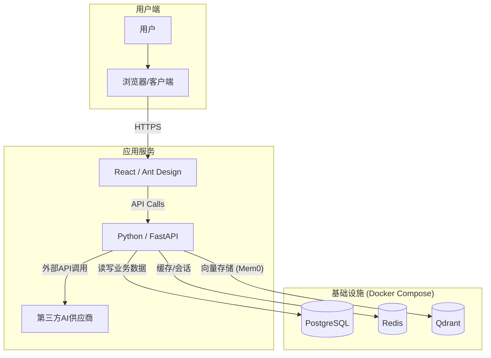

# LYSS AI 平台：项目总览、架构设计与技术选型 (V2)

**版本**: 2.0
**最后更新**: 2025年7月2日
**作者**: 首席解决方案架构师

---

## 1. 项目简介

本文档是 **LYSS AI 平台** 的顶层设计纲领，旨在为开发团队（包括AI编程助手和人类工程师）提供一个清晰、统一的架构蓝图。所有后续的详细设计与开发工作，都应严格遵循本文档中定义的原则和规范。

### 1.1. 项目愿景

根据 [产品需求文档 (PRD)](../../PRD.md)，LYSS AI 平台是一个专为企业环境设计的**多AI供应商聚合与管理平台**。其核心目标是解决企业在集成和使用多样化AI服务时面临的接口不统一、权限管理复杂、成本控制困难以及缺乏个性化体验等核心痛点。

### 1.2. 设计原则

*   **模块化与高内聚**: 功能模块应高度独立，内部逻辑紧密相关，模块间通过定义良好的API进行通信。
*   **可扩展性优先**: 系统的核心部分，特别是供应商集成，必须设计为可插拔的插件化架构。
*   **API驱动开发**: 前后端分离，通过严格的API契约进行协作。
*   **安全与合规**: 所有设计都必须将数据加密、身份认证、权限控制和操作审计放在首位。
*   **开发者体验**: 提供清晰的文档、一致的编码规范和自动化的开发运维流程。

## 2. 核心架构：供应商“作用域” (Provider Scope)

这是平台 **V2 架构的基石**。系统中不再有“系统级”或“个人级”的模糊区分，而是由每个供应商实例的 `scope` 属性来精确控制其全生命周期的行为。

| 属性/行为 | `scope = ORGANIZATION` | `scope = PERSONAL` |
| :--- | :--- | :--- |
| **中文含义** | 组织供应商 | 个人供应商 |
| **创建权限** | 仅限 **管理员 (Admin)** 角色 | **任何已登录用户** |
| **资产归属** | 属于 **组织**，不因创建者离职而受影响 | 严格属于 **创建者个人** |
| **可见性** | 在“模型分发”后台对管理员可见 | 仅对创建者本人可见 |
| **核心能力** | **可被分发** 给组织内其他用户 | **不可被分发**，仅限自用 |

这个模型极大地简化了权限逻辑，使得系统的行为更加可预测和安全。

## 3. 系统架构图

## 4. 技术选型与 rationale (V2 更新)

* **时间基准**: 2025年7月

### 4.1. 后端

| 领域 | 技术/库 | 推荐版本 | 设计思考 |
| :--- | :--- | :--- | :--- |
| **Web框架** | **FastAPI** | `0.115.14` | 性能卓越，基于Python类型提示，自动生成交互式API文档，社区活跃，生态系统成熟。 |
| **ORM** | **SQLAlchemy** | `2.0.41` | Python中最强大、最灵活的ORM，其2.0版本全面拥抱异步，与FastAPI完美契合。 |
| **数据校验** | **Pydantic** | `2.11.7` | FastAPI的基石，通过类型注解实现强大的数据校验、序列化和文档生成。 |
| **用户认证** | **fastapi-users** | `13.0.0` | 提供了一套完整的、经过安全审计的用户认证解决方案，避免重复造轮子。 |
| **智能记忆** | **mem0ai** | `0.1.94` | 轻量级的开源智能记忆库，与Qdrant集成，为平台提供个性化对话能力。 |
| **向量DB客户端**| **qdrant-client**| `1.14.3` | 用于与Qdrant向量数据库进行高效交互的官方Python客户端。 |
| **依赖管理** | **Poetry** | `1.8.2` | 现代化的Python依赖管理工具，提供确定性的依赖解析和独立的虚拟环境管理。 |

### 4.2. 前端

| 领域 | 技术/库 | 推荐版本 | 设计思考 |
| :--- | :--- | :--- | :--- |
| **核心框架** | **React** | `18.3.1` | 业界标准，拥有最庞大的生态系统和社区支持。 |
| **UI组件库** | **Ant Design** | `5.16.2` | 设计精良、组件丰富、文档清晰的企业级UI库。 |
| **AI对话组件**| **@ant-design/x** | `1.4.0` | Ant Design官方推荐的AI对话组件库，提供了高度可定制的原子组件（如`Bubble`, `Sender`）和数据流管理工具 (`useXChat`)，取代了已废弃的`@ant-design/pro-chat`。 |
| **状态管理** | **Zustand** & **React Query** | `4.5.4` & `5.51.1` | **Zustand**: 轻量、简洁的全局客户端状态管理。**React Query**: 强大的异步服务端状态管理，完美解决数据获取的复杂性。 |
| **包管理器** | **pnpm** | `9.5.0` | 速度快，通过硬链接和符号链接的方式高效管理 `node_modules`，节省磁盘空间。 |

### 4.3. 基础设施

| 领域 | 技术 | 推荐版本 | 设计思考 |
| :--- | :--- | :--- | :--- |
| **容器化** | **Docker** & **Docker Compose** | `latest` | 提供了环境一致性、快速部署和隔离性，简化了开发和部署流程。 |
| **数据库** | **PostgreSQL** | `16.3` | 功能强大、高度可靠的开源关系型数据库。 |
| **缓存** | **Redis** | `7.2` | 性能极高的内存数据结构存储，适用于缓存、会话管理等场景。 |
| **向量数据库**| **Qdrant** | `1.10.1` | 专为高性能向量相似性搜索设计的数据库，为智能记忆提供核心支持。 |

---

## 5. 下一步

请继续阅读V2版本的详细设计文档，所有文档均已根据 `Provider Scope` 核心架构进行了重构。
