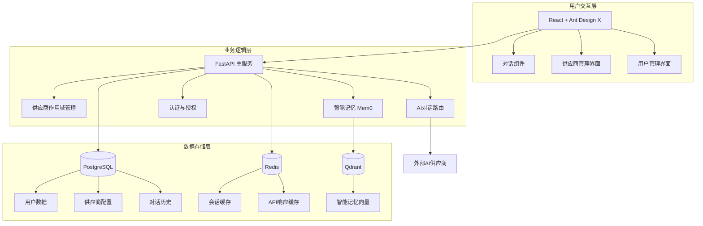

# LYSS AI 平台：整合架构设计方案 V3

**版本**: 3.0  
**最后更新**: 2025年7月7日  
**作者**: 架构师 + AI 助手  

---

## 🎯 **整合后的架构设计**

基于供应商作用域（Provider Scope）的核心理念，我们设计了一个**简化而强大**的三层架构，既保持了成本优化的核心目标，又充分利用了作用域管理的精妙设计。

### 📐 **简化三层架构**



### 🏗️ **供应商作用域在架构中的体现**

#### **1. 数据模型设计**

```python
# 供应商配置模型
class ProviderConfig(BaseModel):
    id: int
    name: str  # 供应商名称，如 "OpenAI-GPT4"
    provider_type: str  # 供应商类型：openai, anthropic, ollama
    scope: ProviderScope  # 核心：ORGANIZATION 或 PERSONAL
    created_by: int  # 创建者用户ID
    api_key: str  # 加密存储的API密钥
    config: dict  # 供应商特定配置
    is_active: bool = True
    created_at: datetime
    updated_at: datetime

# 供应商作用域枚举
class ProviderScope(str, Enum):
    ORGANIZATION = "organization"  # 组织级供应商
    PERSONAL = "personal"  # 个人级供应商

# 供应商分发记录
class ProviderDistribution(BaseModel):
    id: int
    provider_id: int  # 只能是 scope=ORGANIZATION 的供应商
    user_id: int  # 被分发给的用户
    distributed_by: int  # 分发者（管理员）
    distributed_at: datetime
    is_active: bool = True
```

#### **2. 权限控制逻辑**

```python
class ProviderPermission:
    """供应商权限控制核心逻辑"""
    
    @staticmethod
    def can_create_provider(user: User, scope: ProviderScope) -> bool:
        """检查用户是否可以创建指定作用域的供应商"""
        if scope == ProviderScope.ORGANIZATION:
            return user.role == UserRole.ADMIN
        elif scope == ProviderScope.PERSONAL:
            return True  # 任何已登录用户都可以创建个人供应商
        return False
    
    @staticmethod
    def can_view_provider(user: User, provider: ProviderConfig) -> bool:
        """检查用户是否可以查看供应商"""
        if provider.scope == ProviderScope.PERSONAL:
            return provider.created_by == user.id
        elif provider.scope == ProviderScope.ORGANIZATION:
            # 组织供应商：管理员可见，或者已分发给用户
            return (user.role == UserRole.ADMIN or 
                   ProviderDistribution.is_distributed_to_user(provider.id, user.id))
        return False
    
    @staticmethod
    def can_distribute_provider(user: User, provider: ProviderConfig) -> bool:
        """检查用户是否可以分发供应商"""
        return (user.role == UserRole.ADMIN and 
                provider.scope == ProviderScope.ORGANIZATION)
```

### 🧠 **智能记忆集成**

```python
class IntelligentMemoryService:
    """智能记忆服务，集成Mem0实现个性化对话"""
    
    def __init__(self):
        self.mem0 = Memory({
            "vector_store": {
                "provider": "qdrant",
                "config": {
                    "collection_name": "lyss_memories",
                    "host": "localhost",
                    "port": 6333,
                }
            }
        })
    
    async def enhance_conversation(self, user_id: int, messages: List[dict]) -> List[dict]:
        """使用智能记忆增强对话"""
        # 1. 检索相关记忆
        query = messages[-1]["content"]
        relevant_memories = self.mem0.search(
            query=query, 
            user_id=str(user_id),
            limit=5
        )
        
        # 2. 构建记忆上下文
        memory_context = ""
        if relevant_memories.get("results"):
            memory_context = "相关记忆:\n" + "\n".join([
                f"- {memory['memory']}" 
                for memory in relevant_memories["results"]
            ])
        
        # 3. 增强系统提示
        enhanced_messages = messages.copy()
        if memory_context:
            system_message = {
                "role": "system",
                "content": f"""你是一个智能AI助手。以下是用户的相关记忆：
{memory_context}

请基于这些记忆提供个性化的回复。"""
            }
            enhanced_messages.insert(0, system_message)
        
        return enhanced_messages
    
    async def store_conversation(self, user_id: int, messages: List[dict]):
        """存储对话到记忆中"""
        try:
            # 只存储最近的用户消息和AI回复
            self.mem0.add(
                messages=messages[-2:],  # 最后两条消息
                user_id=str(user_id)
            )
        except Exception as e:
            logger.error(f"存储对话记忆失败: {e}")
```

### 🔄 **对话流程设计**

```python
class ConversationService:
    """对话服务，整合供应商管理和智能记忆"""
    
    async def process_chat(self, user_id: int, provider_id: int, 
                          messages: List[dict]) -> dict:
        """处理对话请求"""
        # 1. 验证供应商权限
        provider = await self.get_provider_by_id(provider_id)
        if not ProviderPermission.can_view_provider(user, provider):
            raise PermissionError("无权访问此供应商")
        
        # 2. 使用智能记忆增强对话
        enhanced_messages = await self.memory_service.enhance_conversation(
            user_id, messages
        )
        
        # 3. 检查缓存
        cache_key = self.generate_cache_key(provider_id, enhanced_messages)
        cached_response = await self.redis.get(cache_key)
        if cached_response:
            return json.loads(cached_response)
        
        # 4. 调用AI供应商
        response = await self.call_ai_provider(provider, enhanced_messages)
        
        # 5. 缓存响应
        await self.redis.setex(
            cache_key, 
            expire=3600,  # 1小时缓存
            value=json.dumps(response)
        )
        
        # 6. 存储对话记忆
        conversation_with_response = enhanced_messages + [response["choices"][0]["message"]]
        await self.memory_service.store_conversation(user_id, conversation_with_response)
        
        return response
```

### 🎨 **前端组件设计**

#### **供应商管理界面**

```tsx
// 供应商管理组件
const ProviderManagement: React.FC = () => {
  const [providers, setProviders] = useState<ProviderConfig[]>([]);
  const [currentUser] = useCurrentUser();
  
  // 根据用户角色筛选可见供应商
  const visibleProviders = useMemo(() => {
    return providers.filter(provider => {
      if (provider.scope === 'personal') {
        return provider.created_by === currentUser.id;
      } else {
        // 组织供应商：管理员可见所有，普通用户只能看到分发给自己的
        return currentUser.role === 'admin' || 
               isProviderDistributedToUser(provider.id, currentUser.id);
      }
    });
  }, [providers, currentUser]);
  
  return (
    <div>
      <Card title="供应商管理">
        <Space direction="vertical" style={{ width: '100%' }}>
          {/* 创建供应商按钮 */}
          <Button 
            type="primary" 
            onClick={() => setCreateModalVisible(true)}
            icon={<PlusOutlined />}
          >
            创建供应商
          </Button>
          
          {/* 供应商列表 */}
          <Table
            dataSource={visibleProviders}
            columns={[
              {
                title: '名称',
                dataIndex: 'name',
                key: 'name',
              },
              {
                title: '类型',
                dataIndex: 'provider_type',
                key: 'provider_type',
                render: (type) => <Tag color="blue">{type}</Tag>
              },
              {
                title: '作用域',
                dataIndex: 'scope',
                key: 'scope',
                render: (scope) => (
                  <Tag color={scope === 'organization' ? 'green' : 'orange'}>
                    {scope === 'organization' ? '组织' : '个人'}
                  </Tag>
                )
              },
              {
                title: '状态',
                dataIndex: 'is_active',
                key: 'is_active',
                render: (active) => (
                  <Tag color={active ? 'green' : 'red'}>
                    {active ? '激活' : '禁用'}
                  </Tag>
                )
              },
              {
                title: '操作',
                key: 'actions',
                render: (_, record) => (
                  <Space>
                    <Button size="small" onClick={() => editProvider(record)}>
                      编辑
                    </Button>
                    {/* 只有组织供应商且用户是管理员时才显示分发按钮 */}
                    {record.scope === 'organization' && currentUser.role === 'admin' && (
                      <Button 
                        size="small" 
                        onClick={() => distributeProvider(record)}
                      >
                        分发
                      </Button>
                    )}
                  </Space>
                )
              }
            ]}
          />
        </Space>
      </Card>
    </div>
  );
};
```

#### **智能对话界面**

```tsx
// 智能对话组件
const IntelligentChat: React.FC = () => {
  const [messages, setMessages] = useState<Message[]>([]);
  const [selectedProvider, setSelectedProvider] = useState<ProviderConfig | null>(null);
  const [availableProviders] = useAvailableProviders(); // 获取用户可用的供应商
  
  const handleSendMessage = async (content: string) => {
    const userMessage = { role: 'user', content, id: Date.now() };
    setMessages(prev => [...prev, userMessage]);
    
    try {
      // 调用后端API，自动包含智能记忆处理
      const response = await chatAPI.sendMessage({
        provider_id: selectedProvider?.id,
        messages: [...messages, userMessage]
      });
      
      const aiMessage = {
        role: 'assistant',
        content: response.choices[0].message.content,
        id: Date.now() + 1
      };
      
      setMessages(prev => [...prev, aiMessage]);
    } catch (error) {
      notification.error({
        message: '对话失败',
        description: error.message
      });
    }
  };
  
  return (
    <div style={{ height: '100vh', display: 'flex' }}>
      {/* 侧边栏：供应商选择 */}
      <div style={{ width: 300, borderRight: '1px solid #f0f0f0' }}>
        <Card title="选择AI供应商" size="small">
          <List
            dataSource={availableProviders}
            renderItem={provider => (
              <List.Item
                onClick={() => setSelectedProvider(provider)}
                className={selectedProvider?.id === provider.id ? 'selected' : ''}
                style={{ cursor: 'pointer' }}
              >
                <Space>
                  <Avatar 
                    size="small" 
                    style={{ backgroundColor: provider.scope === 'organization' ? '#52c41a' : '#fa8c16' }}
                  >
                    {provider.name[0]}
                  </Avatar>
                  <div>
                    <div>{provider.name}</div>
                    <div style={{ fontSize: 12, color: '#666' }}>
                      {provider.scope === 'organization' ? '组织' : '个人'}
                    </div>
                  </div>
                </Space>
              </List.Item>
            )}
          />
        </Card>
      </div>
      
      {/* 主聊天区域 */}
      <div style={{ flex: 1 }}>
        {selectedProvider ? (
          <XChat
            messages={messages}
            onSend={handleSendMessage}
            placeholder={`与 ${selectedProvider.name} 对话...`}
          />
        ) : (
          <div style={{ 
            height: '100%', 
            display: 'flex', 
            alignItems: 'center', 
            justifyContent: 'center' 
          }}>
            <Empty description="请选择一个AI供应商开始对话" />
          </div>
        )}
      </div>
    </div>
  );
};
```

### 🔧 **核心优势**

1. **供应商作用域管理**: 通过简单的作用域概念，优雅地解决了复杂的权限管理问题
2. **智能记忆优化**: 集成Mem0实现个性化对话，大幅减少token消耗
3. **灵活的缓存策略**: 多层缓存机制，进一步降低API调用成本
4. **简化的架构**: 三层架构易于理解和维护，适合单人开发
5. **渐进式扩展**: 可以逐步添加更多功能，无需重构核心架构

### 🎯 **与原方案的对比**

| 方面 | 原四层架构 | 整合三层架构 |
|------|------------|-------------|
| **复杂度** | 高（四层服务协调） | 中（三层清晰分离） |
| **维护成本** | 高（多服务依赖） | 低（集中式管理） |
| **权限管理** | 复杂（多层权限） | 简单（作用域控制） |
| **成本优化** | 依赖外部服务 | 内置优化策略 |
| **扩展性** | 好 | 好 |
| **部署复杂度** | 高 | 中 |

这个整合方案既保持了原有的核心优势，又通过供应商作用域的精妙设计，实现了更加清晰和可维护的架构。