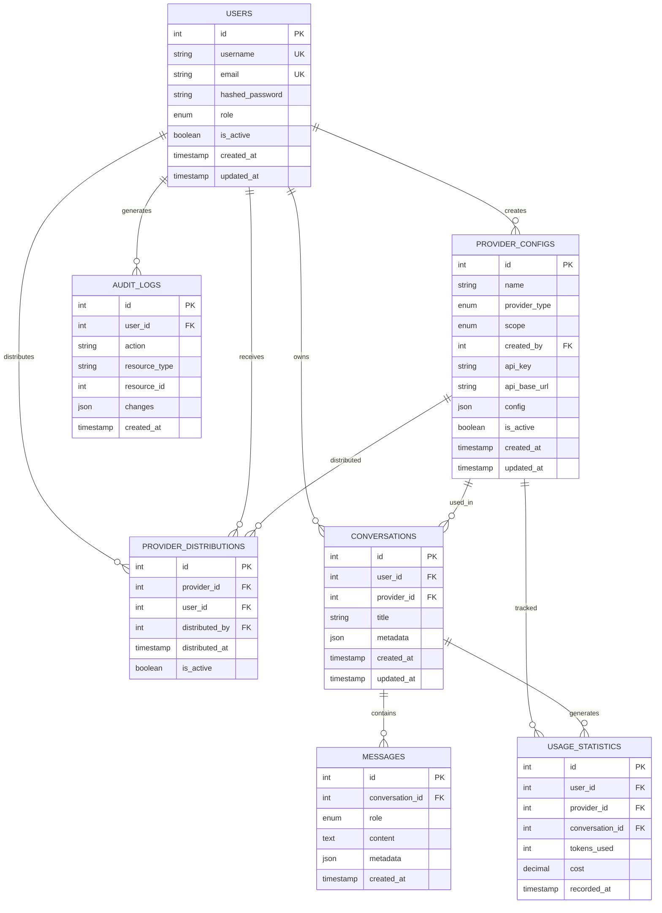

# LYSS AI 平台：数据库设计文档

**版本**: 1.0  
**最后更新**: 2025年7月7日  
**数据库类型**: PostgreSQL 16  

---

## 📋 **数据库概览**

本文档详细描述了 LYSS AI 平台的数据库设计，基于供应商作用域（Provider Scope）架构，采用 PostgreSQL 作为主数据库，Redis 作为缓存层，Qdrant 作为向量数据库。

### 🎯 **设计原则**

1. **数据一致性**: 严格的外键约束和事务处理
2. **性能优化**: 合理的索引设计和查询优化
3. **安全性**: 敏感数据加密存储
4. **可扩展性**: 支持水平扩展和分区
5. **审计跟踪**: 完整的操作日志记录

---

## 🏗️ **数据库架构图**



---

## 📊 **核心表结构**

### **1. 用户表 (users)**

```sql
CREATE TABLE users (
    id SERIAL PRIMARY KEY,
    username VARCHAR(50) NOT NULL UNIQUE,
    email VARCHAR(100) NOT NULL UNIQUE,
    hashed_password VARCHAR(255) NOT NULL,
    role VARCHAR(20) NOT NULL DEFAULT 'user' CHECK (role IN ('admin', 'user')),
    is_active BOOLEAN NOT NULL DEFAULT true,
    created_at TIMESTAMP WITH TIME ZONE DEFAULT CURRENT_TIMESTAMP,
    updated_at TIMESTAMP WITH TIME ZONE DEFAULT CURRENT_TIMESTAMP
);

-- 索引
CREATE INDEX idx_users_username ON users(username);
CREATE INDEX idx_users_email ON users(email);
CREATE INDEX idx_users_role ON users(role);
CREATE INDEX idx_users_is_active ON users(is_active);

-- 触发器：自动更新 updated_at
CREATE OR REPLACE FUNCTION update_updated_at_column()
RETURNS TRIGGER AS $$
BEGIN
    NEW.updated_at = CURRENT_TIMESTAMP;
    RETURN NEW;
END;
$$ language 'plpgsql';

CREATE TRIGGER update_users_updated_at 
    BEFORE UPDATE ON users 
    FOR EACH ROW EXECUTE FUNCTION update_updated_at_column();
```

**字段说明**:
- `id`: 主键，自增
- `username`: 用户名，唯一
- `email`: 邮箱，唯一
- `hashed_password`: 加密后的密码
- `role`: 用户角色，枚举值（admin, user）
- `is_active`: 是否激活
- `created_at`: 创建时间
- `updated_at`: 更新时间

### **2. 供应商配置表 (provider_configs)**

```sql
CREATE TABLE provider_configs (
    id SERIAL PRIMARY KEY,
    name VARCHAR(100) NOT NULL,
    provider_type VARCHAR(20) NOT NULL CHECK (provider_type IN ('openai', 'anthropic', 'ollama', 'custom')),
    scope VARCHAR(20) NOT NULL CHECK (scope IN ('organization', 'personal')),
    created_by INTEGER NOT NULL REFERENCES users(id) ON DELETE CASCADE,
    api_key TEXT NOT NULL, -- 加密存储
    api_base_url VARCHAR(200),
    config JSONB DEFAULT '{}',
    is_active BOOLEAN NOT NULL DEFAULT true,
    created_at TIMESTAMP WITH TIME ZONE DEFAULT CURRENT_TIMESTAMP,
    updated_at TIMESTAMP WITH TIME ZONE DEFAULT CURRENT_TIMESTAMP,
    
    -- 约束：组织级供应商名称唯一
    CONSTRAINT unique_org_provider_name UNIQUE (name, scope) 
        WHERE scope = 'organization',
    
    -- 约束：个人级供应商在同一用户下名称唯一
    CONSTRAINT unique_personal_provider_name UNIQUE (name, created_by, scope) 
        WHERE scope = 'personal'
);

-- 索引
CREATE INDEX idx_provider_configs_created_by ON provider_configs(created_by);
CREATE INDEX idx_provider_configs_scope ON provider_configs(scope);
CREATE INDEX idx_provider_configs_type ON provider_configs(provider_type);
CREATE INDEX idx_provider_configs_is_active ON provider_configs(is_active);
CREATE INDEX idx_provider_configs_name ON provider_configs(name);

-- 触发器：自动更新 updated_at
CREATE TRIGGER update_provider_configs_updated_at 
    BEFORE UPDATE ON provider_configs 
    FOR EACH ROW EXECUTE FUNCTION update_updated_at_column();
```

**字段说明**:
- `id`: 主键，自增
- `name`: 供应商名称
- `provider_type`: 供应商类型（openai, anthropic, ollama, custom）
- `scope`: 作用域（organization, personal）
- `created_by`: 创建者ID，外键关联users表
- `api_key`: API密钥，加密存储
- `api_base_url`: API基础URL
- `config`: 供应商特定配置，JSON格式
- `is_active`: 是否激活

### **3. 供应商分发表 (provider_distributions)**

```sql
CREATE TABLE provider_distributions (
    id SERIAL PRIMARY KEY,
    provider_id INTEGER NOT NULL REFERENCES provider_configs(id) ON DELETE CASCADE,
    user_id INTEGER NOT NULL REFERENCES users(id) ON DELETE CASCADE,
    distributed_by INTEGER NOT NULL REFERENCES users(id) ON DELETE CASCADE,
    distributed_at TIMESTAMP WITH TIME ZONE DEFAULT CURRENT_TIMESTAMP,
    is_active BOOLEAN NOT NULL DEFAULT true,
    
    -- 约束：同一供应商不能重复分发给同一用户
    CONSTRAINT unique_provider_distribution UNIQUE (provider_id, user_id)
);

-- 索引
CREATE INDEX idx_provider_distributions_provider_id ON provider_distributions(provider_id);
CREATE INDEX idx_provider_distributions_user_id ON provider_distributions(user_id);
CREATE INDEX idx_provider_distributions_distributed_by ON provider_distributions(distributed_by);
CREATE INDEX idx_provider_distributions_is_active ON provider_distributions(is_active);

-- 检查约束：只有组织级供应商可以被分发
ALTER TABLE provider_distributions 
ADD CONSTRAINT check_only_org_providers_can_be_distributed 
CHECK (
    provider_id IN (
        SELECT id FROM provider_configs WHERE scope = 'organization'
    )
);
```

**字段说明**:
- `id`: 主键，自增
- `provider_id`: 供应商ID，外键关联provider_configs表
- `user_id`: 用户ID，外键关联users表
- `distributed_by`: 分发者ID，外键关联users表
- `distributed_at`: 分发时间
- `is_active`: 是否激活

### **4. 对话表 (conversations)**

```sql
CREATE TABLE conversations (
    id SERIAL PRIMARY KEY,
    user_id INTEGER NOT NULL REFERENCES users(id) ON DELETE CASCADE,
    provider_id INTEGER NOT NULL REFERENCES provider_configs(id) ON DELETE CASCADE,
    title VARCHAR(200) NOT NULL,
    metadata JSONB DEFAULT '{}',
    created_at TIMESTAMP WITH TIME ZONE DEFAULT CURRENT_TIMESTAMP,
    updated_at TIMESTAMP WITH TIME ZONE DEFAULT CURRENT_TIMESTAMP
);

-- 索引
CREATE INDEX idx_conversations_user_id ON conversations(user_id);
CREATE INDEX idx_conversations_provider_id ON conversations(provider_id);
CREATE INDEX idx_conversations_created_at ON conversations(created_at);
CREATE INDEX idx_conversations_title ON conversations USING gin(to_tsvector('english', title));

-- 触发器：自动更新 updated_at
CREATE TRIGGER update_conversations_updated_at 
    BEFORE UPDATE ON conversations 
    FOR EACH ROW EXECUTE FUNCTION update_updated_at_column();
```

**字段说明**:
- `id`: 主键，自增
- `user_id`: 用户ID，外键关联users表
- `provider_id`: 供应商ID，外键关联provider_configs表
- `title`: 对话标题
- `metadata`: 对话元数据，JSON格式
- `created_at`: 创建时间
- `updated_at`: 更新时间

### **5. 消息表 (messages)**

```sql
CREATE TABLE messages (
    id SERIAL PRIMARY KEY,
    conversation_id INTEGER NOT NULL REFERENCES conversations(id) ON DELETE CASCADE,
    role VARCHAR(20) NOT NULL CHECK (role IN ('user', 'assistant', 'system')),
    content TEXT NOT NULL,
    metadata JSONB DEFAULT '{}',
    created_at TIMESTAMP WITH TIME ZONE DEFAULT CURRENT_TIMESTAMP
);

-- 索引
CREATE INDEX idx_messages_conversation_id ON messages(conversation_id);
CREATE INDEX idx_messages_role ON messages(role);
CREATE INDEX idx_messages_created_at ON messages(created_at);
CREATE INDEX idx_messages_content ON messages USING gin(to_tsvector('english', content));

-- 分区：按创建时间分区（可选，用于大数据量）
-- CREATE TABLE messages_2025 PARTITION OF messages
-- FOR VALUES FROM ('2025-01-01') TO ('2026-01-01');
```

**字段说明**:
- `id`: 主键，自增
- `conversation_id`: 对话ID，外键关联conversations表
- `role`: 消息角色（user, assistant, system）
- `content`: 消息内容
- `metadata`: 消息元数据，JSON格式
- `created_at`: 创建时间

### **6. 使用统计表 (usage_statistics)**

```sql
CREATE TABLE usage_statistics (
    id SERIAL PRIMARY KEY,
    user_id INTEGER NOT NULL REFERENCES users(id) ON DELETE CASCADE,
    provider_id INTEGER NOT NULL REFERENCES provider_configs(id) ON DELETE CASCADE,
    conversation_id INTEGER REFERENCES conversations(id) ON DELETE SET NULL,
    tokens_used INTEGER NOT NULL DEFAULT 0,
    cost DECIMAL(10,6) NOT NULL DEFAULT 0.000000,
    recorded_at TIMESTAMP WITH TIME ZONE DEFAULT CURRENT_TIMESTAMP
);

-- 索引
CREATE INDEX idx_usage_statistics_user_id ON usage_statistics(user_id);
CREATE INDEX idx_usage_statistics_provider_id ON usage_statistics(provider_id);
CREATE INDEX idx_usage_statistics_conversation_id ON usage_statistics(conversation_id);
CREATE INDEX idx_usage_statistics_recorded_at ON usage_statistics(recorded_at);

-- 分区：按时间分区
CREATE TABLE usage_statistics_2025 PARTITION OF usage_statistics
FOR VALUES FROM ('2025-01-01') TO ('2026-01-01');
```

**字段说明**:
- `id`: 主键，自增
- `user_id`: 用户ID，外键关联users表
- `provider_id`: 供应商ID，外键关联provider_configs表
- `conversation_id`: 对话ID，外键关联conversations表
- `tokens_used`: 使用的token数量
- `cost`: 成本
- `recorded_at`: 记录时间

### **7. 审计日志表 (audit_logs)**

```sql
CREATE TABLE audit_logs (
    id SERIAL PRIMARY KEY,
    user_id INTEGER REFERENCES users(id) ON DELETE SET NULL,
    action VARCHAR(50) NOT NULL,
    resource_type VARCHAR(50) NOT NULL,
    resource_id INTEGER,
    changes JSONB DEFAULT '{}',
    ip_address INET,
    user_agent TEXT,
    created_at TIMESTAMP WITH TIME ZONE DEFAULT CURRENT_TIMESTAMP
);

-- 索引
CREATE INDEX idx_audit_logs_user_id ON audit_logs(user_id);
CREATE INDEX idx_audit_logs_action ON audit_logs(action);
CREATE INDEX idx_audit_logs_resource_type ON audit_logs(resource_type);
CREATE INDEX idx_audit_logs_resource_id ON audit_logs(resource_id);
CREATE INDEX idx_audit_logs_created_at ON audit_logs(created_at);

-- 分区：按时间分区
CREATE TABLE audit_logs_2025 PARTITION OF audit_logs
FOR VALUES FROM ('2025-01-01') TO ('2026-01-01');
```

**字段说明**:
- `id`: 主键，自增
- `user_id`: 用户ID，外键关联users表
- `action`: 操作类型（create, update, delete, login等）
- `resource_type`: 资源类型（user, provider, conversation等）
- `resource_id`: 资源ID
- `changes`: 变更内容，JSON格式
- `ip_address`: IP地址
- `user_agent`: 用户代理
- `created_at`: 创建时间

---

## 🔧 **视图和函数**

### **1. 用户可用供应商视图**

```sql
CREATE VIEW user_available_providers AS
SELECT DISTINCT
    pc.id,
    pc.name,
    pc.provider_type,
    pc.scope,
    pc.created_by,
    pc.api_base_url,
    pc.config,
    pc.is_active,
    pc.created_at,
    pc.updated_at,
    CASE 
        WHEN pc.scope = 'personal' THEN pc.created_by
        ELSE pd.user_id
    END AS available_to_user
FROM provider_configs pc
LEFT JOIN provider_distributions pd ON pc.id = pd.provider_id AND pd.is_active = true
WHERE pc.is_active = true
    AND (
        pc.scope = 'personal' 
        OR (pc.scope = 'organization' AND pd.user_id IS NOT NULL)
    );

-- 使用示例：获取用户ID为1的所有可用供应商
-- SELECT * FROM user_available_providers WHERE available_to_user = 1;
```

### **2. 供应商使用统计视图**

```sql
CREATE VIEW provider_usage_summary AS
SELECT 
    pc.id as provider_id,
    pc.name as provider_name,
    pc.provider_type,
    pc.scope,
    COUNT(DISTINCT us.user_id) as unique_users,
    SUM(us.tokens_used) as total_tokens,
    SUM(us.cost) as total_cost,
    AVG(us.tokens_used) as avg_tokens_per_request,
    AVG(us.cost) as avg_cost_per_request,
    MIN(us.recorded_at) as first_used_at,
    MAX(us.recorded_at) as last_used_at
FROM provider_configs pc
LEFT JOIN usage_statistics us ON pc.id = us.provider_id
WHERE pc.is_active = true
GROUP BY pc.id, pc.name, pc.provider_type, pc.scope;
```

### **3. 权限检查函数**

```sql
CREATE OR REPLACE FUNCTION can_user_access_provider(
    p_user_id INTEGER,
    p_provider_id INTEGER
) RETURNS BOOLEAN AS $$
DECLARE
    provider_scope VARCHAR(20);
    provider_creator INTEGER;
    is_distributed BOOLEAN;
BEGIN
    -- 获取供应商信息
    SELECT scope, created_by INTO provider_scope, provider_creator
    FROM provider_configs 
    WHERE id = p_provider_id AND is_active = true;
    
    -- 如果供应商不存在，返回false
    IF NOT FOUND THEN
        RETURN FALSE;
    END IF;
    
    -- 个人供应商：只有创建者可以访问
    IF provider_scope = 'personal' THEN
        RETURN provider_creator = p_user_id;
    END IF;
    
    -- 组织供应商：检查是否已分发给用户
    IF provider_scope = 'organization' THEN
        SELECT EXISTS(
            SELECT 1 FROM provider_distributions 
            WHERE provider_id = p_provider_id 
                AND user_id = p_user_id 
                AND is_active = true
        ) INTO is_distributed;
        
        RETURN is_distributed;
    END IF;
    
    RETURN FALSE;
END;
$$ LANGUAGE plpgsql;

-- 使用示例：检查用户1是否可以访问供应商2
-- SELECT can_user_access_provider(1, 2);
```

---

## 🚀 **性能优化**

### **1. 查询优化**

```sql
-- 创建复合索引优化常用查询
CREATE INDEX idx_provider_configs_scope_active ON provider_configs(scope, is_active);
CREATE INDEX idx_provider_distributions_user_active ON provider_distributions(user_id, is_active);
CREATE INDEX idx_conversations_user_provider ON conversations(user_id, provider_id);
CREATE INDEX idx_messages_conversation_created ON messages(conversation_id, created_at);

-- 优化全文搜索
CREATE INDEX idx_messages_content_gin ON messages USING gin(to_tsvector('english', content));
CREATE INDEX idx_conversations_title_gin ON conversations USING gin(to_tsvector('english', title));
```

### **2. 分区策略**

```sql
-- 为大表启用分区
-- 使用统计表按月分区
CREATE TABLE usage_statistics_2025_01 PARTITION OF usage_statistics
FOR VALUES FROM ('2025-01-01') TO ('2025-02-01');

CREATE TABLE usage_statistics_2025_02 PARTITION OF usage_statistics
FOR VALUES FROM ('2025-02-01') TO ('2025-03-01');

-- 自动创建分区的函数
CREATE OR REPLACE FUNCTION create_monthly_partition(
    table_name TEXT,
    start_date DATE
) RETURNS VOID AS $$
DECLARE
    partition_name TEXT;
    end_date DATE;
BEGIN
    partition_name := table_name || '_' || to_char(start_date, 'YYYY_MM');
    end_date := start_date + INTERVAL '1 month';
    
    EXECUTE format('CREATE TABLE %I PARTITION OF %I FOR VALUES FROM (%L) TO (%L)',
                   partition_name, table_name, start_date, end_date);
END;
$$ LANGUAGE plpgsql;
```

### **3. 缓存策略**

```sql
-- 创建物化视图用于缓存频繁查询的数据
CREATE MATERIALIZED VIEW mv_provider_usage_daily AS
SELECT 
    DATE(recorded_at) as usage_date,
    provider_id,
    SUM(tokens_used) as daily_tokens,
    SUM(cost) as daily_cost,
    COUNT(*) as daily_requests
FROM usage_statistics
GROUP BY DATE(recorded_at), provider_id;

-- 创建唯一索引支持并发刷新
CREATE UNIQUE INDEX idx_mv_provider_usage_daily ON mv_provider_usage_daily(usage_date, provider_id);

-- 定期刷新物化视图
-- 可以通过cron job调用：REFRESH MATERIALIZED VIEW CONCURRENTLY mv_provider_usage_daily;
```

---

## 🔐 **安全配置**

### **1. 数据加密**

```sql
-- 启用数据加密扩展
CREATE EXTENSION IF NOT EXISTS pgcrypto;

-- 创建加密函数
CREATE OR REPLACE FUNCTION encrypt_api_key(api_key TEXT) RETURNS TEXT AS $$
BEGIN
    RETURN crypt(api_key, gen_salt('bf'));
END;
$$ LANGUAGE plpgsql;

-- 创建解密函数（实际使用中应该在应用层处理）
CREATE OR REPLACE FUNCTION decrypt_api_key(encrypted_key TEXT, plain_key TEXT) RETURNS BOOLEAN AS $$
BEGIN
    RETURN encrypted_key = crypt(plain_key, encrypted_key);
END;
$$ LANGUAGE plpgsql;
```

### **2. 行级安全策略**

```sql
-- 启用行级安全
ALTER TABLE provider_configs ENABLE ROW LEVEL SECURITY;
ALTER TABLE conversations ENABLE ROW LEVEL SECURITY;
ALTER TABLE messages ENABLE ROW LEVEL SECURITY;

-- 创建安全策略：用户只能访问自己的数据
CREATE POLICY user_provider_access ON provider_configs
    FOR ALL TO authenticated_users
    USING (
        -- 个人供应商：只有创建者可以访问
        (scope = 'personal' AND created_by = current_user_id()) OR
        -- 组织供应商：检查分发权限
        (scope = 'organization' AND can_user_access_provider(current_user_id(), id))
    );

-- 创建获取当前用户ID的函数
CREATE OR REPLACE FUNCTION current_user_id() RETURNS INTEGER AS $$
BEGIN
    RETURN COALESCE(current_setting('app.current_user_id', true)::INTEGER, 0);
END;
$$ LANGUAGE plpgsql;
```

---

## 📊 **监控和维护**

### **1. 监控查询**

```sql
-- 活跃用户统计
SELECT 
    COUNT(DISTINCT user_id) as active_users_today
FROM usage_statistics 
WHERE recorded_at >= CURRENT_DATE;

-- 供应商使用排行
SELECT 
    pc.name,
    COUNT(*) as usage_count,
    SUM(us.tokens_used) as total_tokens,
    SUM(us.cost) as total_cost
FROM usage_statistics us
JOIN provider_configs pc ON us.provider_id = pc.id
WHERE us.recorded_at >= CURRENT_DATE - INTERVAL '7 days'
GROUP BY pc.id, pc.name
ORDER BY usage_count DESC;

-- 系统健康检查
SELECT 
    schemaname,
    tablename,
    pg_size_pretty(pg_total_relation_size(schemaname||'.'||tablename)) as size,
    pg_stat_get_live_tuples(c.oid) as live_tuples,
    pg_stat_get_dead_tuples(c.oid) as dead_tuples
FROM pg_tables pt
JOIN pg_class c ON c.relname = pt.tablename
WHERE schemaname = 'public'
ORDER BY pg_total_relation_size(schemaname||'.'||tablename) DESC;
```

### **2. 维护脚本**

```sql
-- 清理过期数据
DELETE FROM audit_logs WHERE created_at < CURRENT_DATE - INTERVAL '1 year';
DELETE FROM usage_statistics WHERE recorded_at < CURRENT_DATE - INTERVAL '2 years';

-- 重建统计信息
ANALYZE users;
ANALYZE provider_configs;
ANALYZE conversations;
ANALYZE messages;
ANALYZE usage_statistics;

-- 清理无效的会话
DELETE FROM conversations 
WHERE id NOT IN (
    SELECT DISTINCT conversation_id 
    FROM messages 
    WHERE conversation_id IS NOT NULL
);
```

---

## 🔄 **数据库迁移**

### **Alembic 迁移脚本示例**

```python
"""初始化数据库

Revision ID: 001
Revises: 
Create Date: 2025-07-07 12:00:00.000000

"""
from alembic import op
import sqlalchemy as sa
from sqlalchemy.dialects import postgresql

# revision identifiers
revision = '001'
down_revision = None
branch_labels = None
depends_on = None

def upgrade():
    # 创建用户表
    op.create_table(
        'users',
        sa.Column('id', sa.Integer(), autoincrement=True, nullable=False),
        sa.Column('username', sa.String(length=50), nullable=False),
        sa.Column('email', sa.String(length=100), nullable=False),
        sa.Column('hashed_password', sa.String(length=255), nullable=False),
        sa.Column('role', sa.String(length=20), nullable=False),
        sa.Column('is_active', sa.Boolean(), nullable=False),
        sa.Column('created_at', sa.TIMESTAMP(timezone=True), server_default=sa.text('CURRENT_TIMESTAMP')),
        sa.Column('updated_at', sa.TIMESTAMP(timezone=True), server_default=sa.text('CURRENT_TIMESTAMP')),
        sa.PrimaryKeyConstraint('id'),
        sa.UniqueConstraint('email'),
        sa.UniqueConstraint('username'),
        sa.CheckConstraint("role IN ('admin', 'user')", name='check_user_role')
    )
    
    # 创建供应商配置表
    op.create_table(
        'provider_configs',
        sa.Column('id', sa.Integer(), autoincrement=True, nullable=False),
        sa.Column('name', sa.String(length=100), nullable=False),
        sa.Column('provider_type', sa.String(length=20), nullable=False),
        sa.Column('scope', sa.String(length=20), nullable=False),
        sa.Column('created_by', sa.Integer(), nullable=False),
        sa.Column('api_key', sa.Text(), nullable=False),
        sa.Column('api_base_url', sa.String(length=200), nullable=True),
        sa.Column('config', postgresql.JSONB(), nullable=True),
        sa.Column('is_active', sa.Boolean(), nullable=False),
        sa.Column('created_at', sa.TIMESTAMP(timezone=True), server_default=sa.text('CURRENT_TIMESTAMP')),
        sa.Column('updated_at', sa.TIMESTAMP(timezone=True), server_default=sa.text('CURRENT_TIMESTAMP')),
        sa.ForeignKeyConstraint(['created_by'], ['users.id'], ondelete='CASCADE'),
        sa.PrimaryKeyConstraint('id'),
        sa.CheckConstraint("provider_type IN ('openai', 'anthropic', 'ollama', 'custom')", name='check_provider_type'),
        sa.CheckConstraint("scope IN ('organization', 'personal')", name='check_provider_scope')
    )
    
    # 创建索引
    op.create_index('idx_users_username', 'users', ['username'])
    op.create_index('idx_users_email', 'users', ['email'])
    op.create_index('idx_provider_configs_created_by', 'provider_configs', ['created_by'])
    op.create_index('idx_provider_configs_scope', 'provider_configs', ['scope'])

def downgrade():
    op.drop_table('provider_configs')
    op.drop_table('users')
```

---

## 📝 **总结**

这个数据库设计充分体现了供应商作用域架构的核心理念：

1. **清晰的权限控制**: 通过 `scope` 字段和相关约束，实现了简单而强大的权限管理
2. **性能优化**: 通过合理的索引、分区和缓存策略，确保高性能
3. **安全性**: 敏感数据加密、行级安全策略和审计日志
4. **可扩展性**: 支持水平扩展和功能扩展
5. **可维护性**: 清晰的表结构和完善的维护脚本

这个设计为 LYSS AI 平台提供了坚实的数据基础，支持平台的长期发展和扩展。