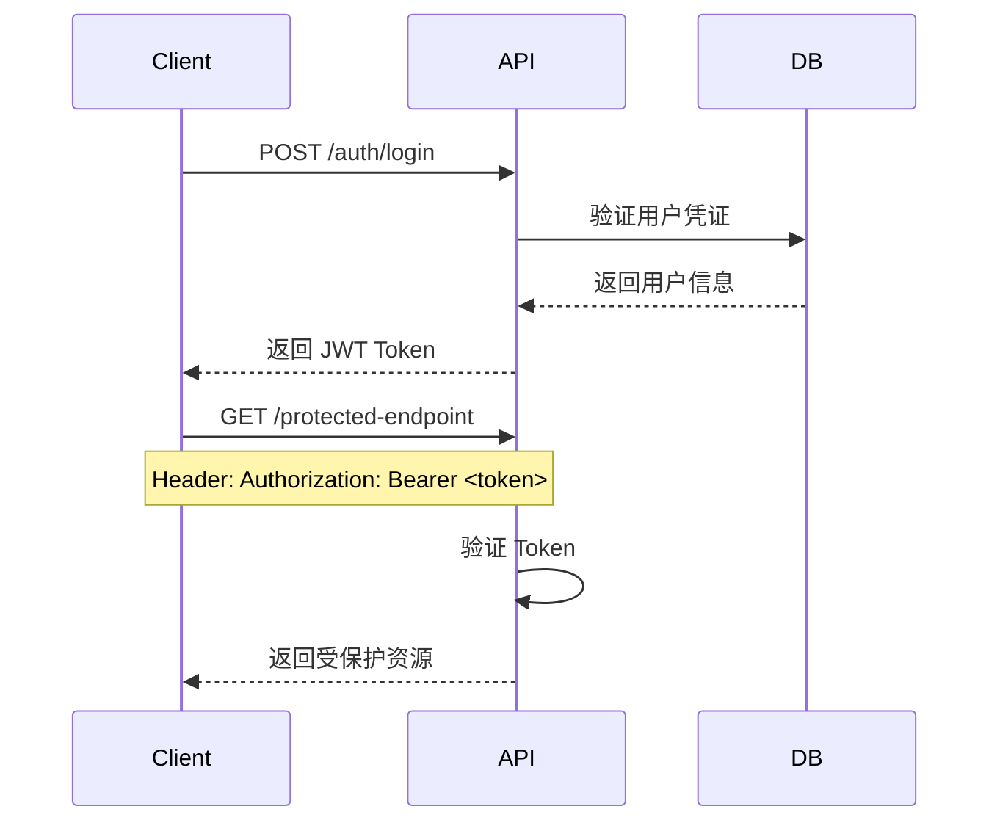

# LYSS AI 平台：API 接口设计文档

**版本**: 1.0  
**最后更新**: 2025年7月7日  
**API版本**: v1  
**基础URL**: `/api/v1`  

---

## 📋 **API 概览**

本文档详细描述了 LYSS AI 平台的 RESTful API 接口设计，基于 FastAPI 框架，提供完整的认证、供应商管理、对话处理等功能。

### 🎯 **设计原则**

1. **RESTful 架构**: 遵循 REST 设计原则
2. **统一响应格式**: 标准化的 JSON 响应格式
3. **完善的错误处理**: 详细的错误码和错误信息
4. **安全认证**: JWT Token 认证机制
5. **API 版本管理**: 支持 API 版本演进
6. **丰富的文档**: 自动生成的 OpenAPI 文档

---

## 🔐 **认证与授权**

### **JWT Token 认证**

所有需要认证的接口都需要在请求头中包含有效的 JWT Token：

```
Authorization: Bearer <token>
```

### **Token 获取流程**



---

## 📊 **统一响应格式**

### **成功响应**

```json
{
  "success": true,
  "data": {
    // 响应数据
  },
  "message": "操作成功",
  "timestamp": "2025-07-07T12:00:00Z"
}
```

### **错误响应**

```json
{
  "success": false,
  "error": {
    "code": "VALIDATION_ERROR",
    "message": "请求参数验证失败",
    "details": {
      "field": "username",
      "reason": "用户名长度必须在3-50个字符之间"
    }
  },
  "timestamp": "2025-07-07T12:00:00Z"
}
```

### **分页响应**

```json
{
  "success": true,
  "data": {
    "items": [
      // 数据项列表
    ],
    "pagination": {
      "page": 1,
      "page_size": 20,
      "total": 100,
      "total_pages": 5,
      "has_next": true,
      "has_prev": false
    }
  },
  "message": "查询成功",
  "timestamp": "2025-07-07T12:00:00Z"
}
```

---

## 🔑 **认证模块 API**

### **用户注册**

```http
POST /api/v1/auth/register
```

**请求体**:
```json
{
  "username": "testuser",
  "email": "test@example.com",
  "password": "password123",
  "confirm_password": "password123"
}
```

**响应**:
```json
{
  "success": true,
  "data": {
    "user": {
      "id": 1,
      "username": "testuser",
      "email": "test@example.com",
      "role": "user",
      "is_active": true,
      "created_at": "2025-07-07T12:00:00Z"
    },
    "access_token": "eyJ0eXAiOiJKV1QiLCJhbGciOiJIUzI1NiJ9...",
    "token_type": "bearer",
    "expires_in": 1800
  },
  "message": "注册成功"
}
```

### **用户登录**

```http
POST /api/v1/auth/login
```

**请求体**:
```json
{
  "username": "testuser",
  "password": "password123"
}
```

**响应**:
```json
{
  "success": true,
  "data": {
    "user": {
      "id": 1,
      "username": "testuser",
      "email": "test@example.com",
      "role": "user",
      "is_active": true
    },
    "access_token": "eyJ0eXAiOiJKV1QiLCJhbGciOiJIUzI1NiJ9...",
    "token_type": "bearer",
    "expires_in": 1800
  },
  "message": "登录成功"
}
```

### **获取当前用户信息**

```http
GET /api/v1/auth/me
```

**响应**:
```json
{
  "success": true,
  "data": {
    "id": 1,
    "username": "testuser",
    "email": "test@example.com",
    "role": "user",
    "is_active": true,
    "created_at": "2025-07-07T12:00:00Z",
    "updated_at": "2025-07-07T12:00:00Z"
  },
  "message": "获取用户信息成功"
}
```

### **刷新Token**

```http
POST /api/v1/auth/refresh
```

**响应**:
```json
{
  "success": true,
  "data": {
    "access_token": "eyJ0eXAiOiJKV1QiLCJhbGciOiJIUzI1NiJ9...",
    "token_type": "bearer",
    "expires_in": 1800
  },
  "message": "Token刷新成功"
}
```

### **用户登出**

```http
POST /api/v1/auth/logout
```

**响应**:
```json
{
  "success": true,
  "data": null,
  "message": "登出成功"
}
```

---

## 🤖 **供应商管理 API**

### **创建供应商配置**

```http
POST /api/v1/providers
```

**请求体**:
```json
{
  "name": "OpenAI GPT-4",
  "provider_type": "openai",
  "scope": "personal",
  "api_key": "sk-xxx...",
  "api_base_url": "https://api.openai.com/v1",
  "config": {
    "model": "gpt-4",
    "temperature": 0.7,
    "max_tokens": 2000
  }
}
```

**响应**:
```json
{
  "success": true,
  "data": {
    "id": 1,
    "name": "OpenAI GPT-4",
    "provider_type": "openai",
    "scope": "personal",
    "created_by": 1,
    "api_base_url": "https://api.openai.com/v1",
    "config": {
      "model": "gpt-4",
      "temperature": 0.7,
      "max_tokens": 2000
    },
    "is_active": true,
    "created_at": "2025-07-07T12:00:00Z",
    "updated_at": "2025-07-07T12:00:00Z"
  },
  "message": "供应商创建成功"
}
```

### **获取供应商列表**

```http
GET /api/v1/providers?page=1&page_size=20&scope=personal&provider_type=openai&is_active=true
```

**查询参数**:
- `page`: 页码，默认1
- `page_size`: 每页数量，默认20，最大100
- `scope`: 作用域过滤（organization/personal）
- `provider_type`: 供应商类型过滤
- `is_active`: 是否激活过滤

**响应**:
```json
{
  "success": true,
  "data": {
    "items": [
      {
        "id": 1,
        "name": "OpenAI GPT-4",
        "provider_type": "openai",
        "scope": "personal",
        "created_by": 1,
        "api_base_url": "https://api.openai.com/v1",
        "config": {
          "model": "gpt-4",
          "temperature": 0.7
        },
        "is_active": true,
        "created_at": "2025-07-07T12:00:00Z",
        "updated_at": "2025-07-07T12:00:00Z"
      }
    ],
    "pagination": {
      "page": 1,
      "page_size": 20,
      "total": 1,
      "total_pages": 1,
      "has_next": false,
      "has_prev": false
    }
  },
  "message": "获取供应商列表成功"
}
```

### **获取可用供应商列表**

```http
GET /api/v1/providers/available
```

**响应**: 返回当前用户可以使用的所有供应商（包括个人供应商和已分发的组织供应商）

### **获取供应商详情**

```http
GET /api/v1/providers/{provider_id}
```

**响应**:
```json
{
  "success": true,
  "data": {
    "id": 1,
    "name": "OpenAI GPT-4",
    "provider_type": "openai",
    "scope": "personal",
    "created_by": 1,
    "api_base_url": "https://api.openai.com/v1",
    "config": {
      "model": "gpt-4",
      "temperature": 0.7,
      "max_tokens": 2000
    },
    "is_active": true,
    "created_at": "2025-07-07T12:00:00Z",
    "updated_at": "2025-07-07T12:00:00Z"
  },
  "message": "获取供应商详情成功"
}
```

### **更新供应商配置**

```http
PUT /api/v1/providers/{provider_id}
```

**请求体**:
```json
{
  "name": "OpenAI GPT-4 Turbo",
  "api_base_url": "https://api.openai.com/v1",
  "config": {
    "model": "gpt-4-turbo",
    "temperature": 0.8,
    "max_tokens": 4000
  }
}
```

### **删除供应商**

```http
DELETE /api/v1/providers/{provider_id}
```

**响应**:
```json
{
  "success": true,
  "data": null,
  "message": "供应商删除成功"
}
```

### **分发组织供应商**

```http
POST /api/v1/providers/{provider_id}/distribute
```

**权限**: 仅管理员可操作组织级供应商

**请求体**:
```json
{
  "user_ids": [2, 3, 4]
}
```

**响应**:
```json
{
  "success": true,
  "data": {
    "provider_id": 1,
    "distributed_to": [2, 3, 4],
    "distributed_at": "2025-07-07T12:00:00Z"
  },
  "message": "供应商分发成功"
}
```

### **取消分发**

```http
DELETE /api/v1/providers/{provider_id}/distribute/{user_id}
```

### **获取供应商分发记录**

```http
GET /api/v1/providers/{provider_id}/distributions
```

**响应**:
```json
{
  "success": true,
  "data": [
    {
      "id": 1,
      "user_id": 2,
      "user": {
        "id": 2,
        "username": "user2",
        "email": "user2@example.com"
      },
      "distributed_by": 1,
      "distributor": {
        "id": 1,
        "username": "admin",
        "email": "admin@example.com"
      },
      "distributed_at": "2025-07-07T12:00:00Z",
      "is_active": true
    }
  ],
  "message": "获取分发记录成功"
}
```

---

## 💬 **对话模块 API**

### **发送聊天消息**

```http
POST /api/v1/chat/messages
```

**请求体**:
```json
{
  "provider_id": 1,
  "conversation_id": 123,
  "messages": [
    {
      "role": "user",
      "content": "你好，请介绍一下Python编程语言"
    }
  ]
}
```

**响应**:
```json
{
  "success": true,
  "data": {
    "message": {
      "id": 456,
      "role": "assistant",
      "content": "Python是一种高级编程语言，具有简洁易读的语法...",
      "metadata": {
        "model": "gpt-4",
        "tokens_used": 150,
        "cost": 0.003,
        "cached": false
      },
      "created_at": "2025-07-07T12:00:00Z"
    },
    "conversation": {
      "id": 123,
      "title": "关于Python编程",
      "updated_at": "2025-07-07T12:00:00Z"
    },
    "provider": {
      "id": 1,
      "name": "OpenAI GPT-4",
      "provider_type": "openai"
    }
  },
  "message": "对话成功"
}
```

### **流式对话**

```http
POST /api/v1/chat/stream
```

**请求体**: 同上

**响应**: Server-Sent Events (SSE) 流

```
data: {"type": "start", "conversation_id": 123}

data: {"type": "content", "content": "Python"}

data: {"type": "content", "content": "是一种"}

data: {"type": "content", "content": "高级编程语言"}

data: {"type": "end", "message_id": 456, "tokens_used": 150, "cost": 0.003}
```

### **创建对话**

```http
POST /api/v1/conversations
```

**请求体**:
```json
{
  "title": "关于Python编程的讨论",
  "provider_id": 1,
  "metadata": {
    "tags": ["编程", "Python"],
    "description": "学习Python编程语言"
  }
}
```

**响应**:
```json
{
  "success": true,
  "data": {
    "id": 123,
    "title": "关于Python编程的讨论",
    "user_id": 1,
    "provider_id": 1,
    "metadata": {
      "tags": ["编程", "Python"],
      "description": "学习Python编程语言"
    },
    "created_at": "2025-07-07T12:00:00Z",
    "updated_at": "2025-07-07T12:00:00Z"
  },
  "message": "对话创建成功"
}
```

### **获取对话列表**

```http
GET /api/v1/conversations?page=1&page_size=20&provider_id=1&search=Python
```

**查询参数**:
- `page`: 页码
- `page_size`: 每页数量
- `provider_id`: 供应商ID过滤
- `search`: 标题搜索关键词

**响应**:
```json
{
  "success": true,
  "data": {
    "items": [
      {
        "id": 123,
        "title": "关于Python编程的讨论",
        "provider": {
          "id": 1,
          "name": "OpenAI GPT-4",
          "provider_type": "openai"
        },
        "message_count": 10,
        "last_message_at": "2025-07-07T12:00:00Z",
        "created_at": "2025-07-07T10:00:00Z"
      }
    ],
    "pagination": {
      "page": 1,
      "page_size": 20,
      "total": 1,
      "total_pages": 1,
      "has_next": false,
      "has_prev": false
    }
  },
  "message": "获取对话列表成功"
}
```

### **获取对话详情**

```http
GET /api/v1/conversations/{conversation_id}
```

**响应**:
```json
{
  "success": true,
  "data": {
    "id": 123,
    "title": "关于Python编程的讨论",
    "user_id": 1,
    "provider": {
      "id": 1,
      "name": "OpenAI GPT-4",
      "provider_type": "openai"
    },
    "messages": [
      {
        "id": 1,
        "role": "user",
        "content": "你好，请介绍一下Python编程语言",
        "created_at": "2025-07-07T10:00:00Z"
      },
      {
        "id": 2,
        "role": "assistant",
        "content": "Python是一种高级编程语言...",
        "metadata": {
          "model": "gpt-4",
          "tokens_used": 150,
          "cost": 0.003
        },
        "created_at": "2025-07-07T10:01:00Z"
      }
    ],
    "metadata": {
      "tags": ["编程", "Python"],
      "description": "学习Python编程语言"
    },
    "created_at": "2025-07-07T10:00:00Z",
    "updated_at": "2025-07-07T12:00:00Z"
  },
  "message": "获取对话详情成功"
}
```

### **更新对话**

```http
PUT /api/v1/conversations/{conversation_id}
```

**请求体**:
```json
{
  "title": "Python编程学习笔记",
  "metadata": {
    "tags": ["编程", "Python", "学习"],
    "description": "深入学习Python编程语言"
  }
}
```

### **删除对话**

```http
DELETE /api/v1/conversations/{conversation_id}
```

---

## 📊 **统计与监控 API**

### **获取使用统计**

```http
GET /api/v1/statistics/usage?start_date=2025-07-01&end_date=2025-07-07&provider_id=1&granularity=daily
```

**查询参数**:
- `start_date`: 开始日期
- `end_date`: 结束日期
- `provider_id`: 供应商ID（可选）
- `granularity`: 统计粒度（daily/hourly/monthly）

**响应**:
```json
{
  "success": true,
  "data": {
    "summary": {
      "total_requests": 150,
      "total_tokens": 45000,
      "total_cost": 0.675,
      "average_tokens_per_request": 300
    },
    "breakdown": [
      {
        "date": "2025-07-01",
        "requests": 25,
        "tokens": 7500,
        "cost": 0.1125
      },
      {
        "date": "2025-07-02",
        "requests": 30,
        "tokens": 9000,
        "cost": 0.135
      }
    ],
    "by_provider": [
      {
        "provider_id": 1,
        "provider_name": "OpenAI GPT-4",
        "requests": 100,
        "tokens": 30000,
        "cost": 0.45
      }
    ]
  },
  "message": "获取使用统计成功"
}
```

### **获取系统健康状态**

```http
GET /api/v1/system/health
```

**响应**:
```json
{
  "success": true,
  "data": {
    "status": "healthy",
    "version": "1.0.0",
    "uptime": 3600,
    "components": {
      "database": {
        "status": "healthy",
        "response_time": 5
      },
      "redis": {
        "status": "healthy",
        "response_time": 2
      },
      "qdrant": {
        "status": "healthy",
        "response_time": 8
      }
    },
    "metrics": {
      "active_users": 25,
      "total_conversations": 150,
      "total_messages": 1200
    }
  },
  "message": "系统状态正常"
}
```

---

## 🎛️ **管理员 API**

### **获取所有用户**

```http
GET /api/v1/admin/users?page=1&page_size=20&role=user&is_active=true&search=username
```

**权限**: 仅管理员

**响应**:
```json
{
  "success": true,
  "data": {
    "items": [
      {
        "id": 2,
        "username": "testuser",
        "email": "test@example.com",
        "role": "user",
        "is_active": true,
        "created_at": "2025-07-07T12:00:00Z",
        "statistics": {
          "total_conversations": 10,
          "total_messages": 50,
          "total_tokens": 15000,
          "total_cost": 0.225
        }
      }
    ],
    "pagination": {
      "page": 1,
      "page_size": 20,
      "total": 1,
      "total_pages": 1,
      "has_next": false,
      "has_prev": false
    }
  },
  "message": "获取用户列表成功"
}
```

### **更新用户状态**

```http
PUT /api/v1/admin/users/{user_id}/status
```

**权限**: 仅管理员

**请求体**:
```json
{
  "is_active": false,
  "reason": "违反使用条款"
}
```

### **获取系统统计**

```http
GET /api/v1/admin/statistics/system
```

**权限**: 仅管理员

**响应**:
```json
{
  "success": true,
  "data": {
    "users": {
      "total": 100,
      "active": 85,
      "new_this_month": 15
    },
    "providers": {
      "total": 25,
      "organization": 10,
      "personal": 15,
      "by_type": {
        "openai": 12,
        "anthropic": 8,
        "ollama": 3,
        "custom": 2
      }
    },
    "conversations": {
      "total": 1000,
      "today": 50,
      "this_week": 300
    },
    "usage": {
      "total_tokens": 1000000,
      "total_cost": 150.75,
      "this_month_tokens": 250000,
      "this_month_cost": 37.50
    }
  },
  "message": "获取系统统计成功"
}
```

---

## 🔧 **错误码参考**

### **通用错误码**

| 错误码 | HTTP状态码 | 描述 |
|--------|------------|------|
| `VALIDATION_ERROR` | 400 | 请求参数验证失败 |
| `UNAUTHORIZED` | 401 | 未授权访问 |
| `FORBIDDEN` | 403 | 权限不足 |
| `NOT_FOUND` | 404 | 资源不存在 |
| `CONFLICT` | 409 | 资源冲突 |
| `RATE_LIMITED` | 429 | 请求频率超限 |
| `INTERNAL_ERROR` | 500 | 服务器内部错误 |

### **业务错误码**

| 错误码 | HTTP状态码 | 描述 |
|--------|------------|------|
| `USER_ALREADY_EXISTS` | 409 | 用户已存在 |
| `INVALID_CREDENTIALS` | 401 | 用户名或密码错误 |
| `TOKEN_EXPIRED` | 401 | Token已过期 |
| `PROVIDER_NOT_ACCESSIBLE` | 403 | 无权访问该供应商 |
| `PROVIDER_INACTIVE` | 400 | 供应商未激活 |
| `CONVERSATION_NOT_FOUND` | 404 | 对话不存在 |
| `AI_API_ERROR` | 502 | AI供应商API错误 |
| `INSUFFICIENT_QUOTA` | 403 | 配额不足 |

---

## 📚 **SDK 和工具**

### **Python SDK 示例**

```python
from lyss_ai_client import LyssClient

# 初始化客户端
client = LyssClient(
    base_url="http://localhost:8000/api/v1",
    api_key="your_jwt_token"
)

# 创建供应商
provider = client.providers.create(
    name="OpenAI GPT-4",
    provider_type="openai",
    scope="personal",
    api_key="sk-xxx...",
    config={"model": "gpt-4", "temperature": 0.7}
)

# 发送聊天消息
response = client.chat.send_message(
    provider_id=provider.id,
    messages=[
        {"role": "user", "content": "Hello, world!"}
    ]
)

print(response.message.content)
```

### **JavaScript SDK 示例**

```javascript
import { LyssClient } from '@lyss-ai/client';

// 初始化客户端
const client = new LyssClient({
  baseURL: 'http://localhost:8000/api/v1',
  apiKey: 'your_jwt_token'
});

// 创建供应商
const provider = await client.providers.create({
  name: 'OpenAI GPT-4',
  providerType: 'openai',
  scope: 'personal',
  apiKey: 'sk-xxx...',
  config: { model: 'gpt-4', temperature: 0.7 }
});

// 发送聊天消息
const response = await client.chat.sendMessage({
  providerId: provider.id,
  messages: [
    { role: 'user', content: 'Hello, world!' }
  ]
});

console.log(response.message.content);
```

---

## 📖 **OpenAPI 规范**

完整的 OpenAPI 3.0 规范文档可以通过以下地址访问：

- **Swagger UI**: `http://localhost:8000/docs`
- **ReDoc**: `http://localhost:8000/redoc`
- **OpenAPI JSON**: `http://localhost:8000/openapi.json`

---

## 🚀 **API 版本演进**

### **版本策略**

1. **向后兼容**: 新版本保持向后兼容性
2. **废弃通知**: 废弃功能提前通知
3. **版本号管理**: 使用语义化版本号
4. **迁移指南**: 提供详细的迁移文档

### **版本生命周期**

- **v1.0**: 当前版本，稳定支持
- **v1.1**: 开发中，新增功能
- **v2.0**: 规划中，重大架构调整

---

这个 API 设计文档为 LYSS AI 平台提供了完整、清晰和可扩展的接口规范，支持前端开发、第三方集成和平台的长期发展。