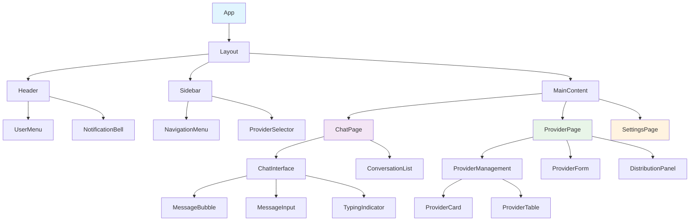

# LYSS AI 平台：前端组件设计文档

**版本**: 1.0  
**最后更新**: 2025年7月7日  
**技术栈**: React + TypeScript + Ant Design X + Zustand  

---

## 📋 **前端架构概览**

本文档详细描述了 LYSS AI 平台前端组件的设计与实现，基于现代化的 React 生态，采用组件化和模块化的设计理念。

### 🎯 **设计原则**

1. **组件化开发**: 高度复用的原子组件和业务组件
2. **类型安全**: 完整的 TypeScript 类型定义
3. **状态管理**: Zustand + React Query 的混合状态管理
4. **用户体验**: 响应式设计和流畅的交互动画
5. **可维护性**: 清晰的代码结构和完善的文档

---

## 🏗️ **组件架构图**



---

## 📦 **项目结构**

```
src/
├── components/                 # 通用组件
│   ├── common/                # 通用UI组件
│   │   ├── Loading/
│   │   ├── ErrorBoundary/
│   │   ├── ConfirmModal/
│   │   └── PageHeader/
│   ├── layout/                # 布局组件
│   │   ├── AppLayout/
│   │   ├── Header/
│   │   ├── Sidebar/
│   │   └── Footer/
│   ├── auth/                  # 认证相关组件
│   │   ├── LoginForm/
│   │   ├── RegisterForm/
│   │   └── ProtectedRoute/
│   ├── provider/              # 供应商管理组件
│   │   ├── ProviderManagement/
│   │   ├── ProviderForm/
│   │   ├── ProviderCard/
│   │   ├── ProviderTable/
│   │   └── DistributionPanel/
│   └── chat/                  # 对话相关组件
│       ├── ChatInterface/
│       ├── ConversationList/
│       ├── MessageBubble/
│       ├── MessageInput/
│       └── TypingIndicator/
├── pages/                     # 页面组件
│   ├── LoginPage/
│   ├── ChatPage/
│   ├── ProviderPage/
│   ├── SettingsPage/
│   └── AdminPage/
├── hooks/                     # 自定义Hooks
│   ├── useAuth.ts
│   ├── useProviders.ts
│   ├── useChat.ts
│   └── useWebSocket.ts
├── store/                     # 状态管理
│   ├── auth.ts
│   ├── providers.ts
│   ├── chat.ts
│   └── ui.ts
├── services/                  # API服务
│   ├── api.ts
│   ├── auth.ts
│   ├── providers.ts
│   └── chat.ts
├── types/                     # 类型定义
│   ├── user.ts
│   ├── provider.ts
│   ├── chat.ts
│   └── api.ts
├── utils/                     # 工具函数
│   ├── constants.ts
│   ├── helpers.ts
│   └── validation.ts
└── styles/                    # 样式文件
    ├── globals.css
    ├── variables.css
    └── components/
```

---

## 🎨 **通用组件**

### **1. 页面头部组件 (PageHeader)**

```tsx
// components/common/PageHeader/index.tsx
import React from 'react';
import { PageHeader as AntPageHeader, Button, Space, Breadcrumb } from 'antd';
import { ArrowLeftOutlined } from '@ant-design/icons';
import { useNavigate } from 'react-router-dom';

interface PageHeaderProps {
  title: string;
  subtitle?: string;
  showBack?: boolean;
  breadcrumb?: Array<{
    path?: string;
    breadcrumbName: string;
  }>;
  extra?: React.ReactNode;
  children?: React.ReactNode;
}

export const PageHeader: React.FC<PageHeaderProps> = ({
  title,
  subtitle,
  showBack = false,
  breadcrumb,
  extra,
  children
}) => {
  const navigate = useNavigate();

  const handleBack = () => {
    navigate(-1);
  };

  return (
    <div className="page-header">
      {breadcrumb && (
        <Breadcrumb style={{ marginBottom: 16 }}>
          {breadcrumb.map((item, index) => (
            <Breadcrumb.Item 
              key={index}
              onClick={item.path ? () => navigate(item.path!) : undefined}
              style={{ cursor: item.path ? 'pointer' : 'default' }}
            >
              {item.breadcrumbName}
            </Breadcrumb.Item>
          ))}
        </Breadcrumb>
      )}
      
      <AntPageHeader
        onBack={showBack ? handleBack : undefined}
        title={title}
        subTitle={subtitle}
        extra={extra}
        style={{ padding: 0 }}
      />
      
      {children && (
        <div style={{ marginTop: 16 }}>
          {children}
        </div>
      )}
    </div>
  );
};
```

### **2. 加载组件 (Loading)**

```tsx
// components/common/Loading/index.tsx
import React from 'react';
import { Spin, Typography } from 'antd';
import './styles.css';

interface LoadingProps {
  size?: 'small' | 'default' | 'large';
  tip?: string;
  spinning?: boolean;
  children?: React.ReactNode;
  fullscreen?: boolean;
}

export const Loading: React.FC<LoadingProps> = ({
  size = 'default',
  tip,
  spinning = true,
  children,
  fullscreen = false
}) => {
  if (fullscreen) {
    return (
      <div className="fullscreen-loading">
        <Spin size={size} tip={tip} spinning={spinning}>
          <div style={{ minHeight: '100vh' }}>
            {children}
          </div>
        </Spin>
      </div>
    );
  }

  return (
    <Spin size={size} tip={tip} spinning={spinning}>
      {children}
    </Spin>
  );
};

// 页面级加载组件
export const PageLoading: React.FC<{ tip?: string }> = ({ tip = "加载中..." }) => (
  <div className="page-loading">
    <Spin size="large" tip={tip} />
  </div>
);

// 按钮级加载组件
export const ButtonLoading: React.FC = () => (
  <Spin size="small" />
);
```

### **3. 错误边界组件 (ErrorBoundary)**

```tsx
// components/common/ErrorBoundary/index.tsx
import React, { Component, ErrorInfo, ReactNode } from 'react';
import { Result, Button } from 'antd';

interface Props {
  children: ReactNode;
  fallback?: ReactNode;
}

interface State {
  hasError: boolean;
  error?: Error;
}

export class ErrorBoundary extends Component<Props, State> {
  public state: State = {
    hasError: false
  };

  public static getDerivedStateFromError(error: Error): State {
    return { hasError: true, error };
  }

  public componentDidCatch(error: Error, errorInfo: ErrorInfo) {
    console.error('Uncaught error:', error, errorInfo);
  }

  private handleReload = () => {
    window.location.reload();
  };

  private handleReset = () => {
    this.setState({ hasError: false, error: undefined });
  };

  public render() {
    if (this.state.hasError) {
      if (this.props.fallback) {
        return this.props.fallback;
      }

      return (
        <Result
          status="error"
          title="出现了意外错误"
          subTitle={this.state.error?.message || "页面遇到了一些问题，请尝试刷新页面"}
          extra={[
            <Button type="primary" key="reload" onClick={this.handleReload}>
              刷新页面
            </Button>,
            <Button key="reset" onClick={this.handleReset}>
              重试
            </Button>
          ]}
        />
      );
    }

    return this.props.children;
  }
}
```

---

## 🔐 **认证组件**

### **1. 登录表单组件 (LoginForm)**

```tsx
// components/auth/LoginForm/index.tsx
import React, { useState } from 'react';
import { Form, Input, Button, Checkbox, message, Divider } from 'antd';
import { UserOutlined, LockOutlined, GithubOutlined } from '@ant-design/icons';
import { useAuthStore } from '@/store/auth';
import { authAPI } from '@/services/auth';
import './styles.css';

interface LoginFormData {
  username: string;
  password: string;
  remember: boolean;
}

export const LoginForm: React.FC = () => {
  const [loading, setLoading] = useState(false);
  const { setAuth } = useAuthStore();

  const handleSubmit = async (values: LoginFormData) => {
    setLoading(true);
    try {
      const response = await authAPI.login({
        username: values.username,
        password: values.password
      });

      setAuth(response.data.user, response.data.access_token);
      
      if (values.remember) {
        localStorage.setItem('remember_username', values.username);
      } else {
        localStorage.removeItem('remember_username');
      }

      message.success('登录成功');
    } catch (error: any) {
      message.error(error?.response?.data?.error?.message || '登录失败');
    } finally {
      setLoading(false);
    }
  };

  return (
    <div className="login-form">
      <div className="login-form-header">
        <h2>登录 LYSS AI 平台</h2>
        <p>使用您的账号登录，开始智能对话之旅</p>
      </div>

      <Form
        name="login"
        onFinish={handleSubmit}
        autoComplete="off"
        size="large"
        initialValues={{
          remember: true,
          username: localStorage.getItem('remember_username') || ''
        }}
      >
        <Form.Item
          name="username"
          rules={[
            { required: true, message: '请输入用户名' },
            { min: 3, message: '用户名至少3个字符' }
          ]}
        >
          <Input
            prefix={<UserOutlined />}
            placeholder="用户名"
            autoComplete="username"
          />
        </Form.Item>

        <Form.Item
          name="password"
          rules={[
            { required: true, message: '请输入密码' },
            { min: 6, message: '密码至少6个字符' }
          ]}
        >
          <Input.Password
            prefix={<LockOutlined />}
            placeholder="密码"
            autoComplete="current-password"
          />
        </Form.Item>

        <Form.Item>
          <div style={{ display: 'flex', justifyContent: 'space-between' }}>
            <Form.Item name="remember" valuePropName="checked" noStyle>
              <Checkbox>记住用户名</Checkbox>
            </Form.Item>
            <a href="/forgot-password">忘记密码？</a>
          </div>
        </Form.Item>

        <Form.Item>
          <Button
            type="primary"
            htmlType="submit"
            loading={loading}
            block
          >
            登录
          </Button>
        </Form.Item>

        <Divider>或</Divider>

        <div className="oauth-buttons">
          <Button
            icon={<GithubOutlined />}
            size="large"
            block
            onClick={() => message.info('GitHub 登录功能开发中')}
          >
            使用 GitHub 登录
          </Button>
        </div>

        <div className="login-footer">
          还没有账号？ <a href="/register">立即注册</a>
        </div>
      </Form>
    </div>
  );
};
```

### **2. 受保护路由组件 (ProtectedRoute)**

```tsx
// components/auth/ProtectedRoute/index.tsx
import React from 'react';
import { Navigate, useLocation } from 'react-router-dom';
import { useAuthStore } from '@/store/auth';
import { UserRole } from '@/types/user';
import { Result, Button } from 'antd';

interface ProtectedRouteProps {
  children: React.ReactNode;
  requireRole?: UserRole;
  redirectTo?: string;
}

export const ProtectedRoute: React.FC<ProtectedRouteProps> = ({
  children,
  requireRole,
  redirectTo = '/login'
}) => {
  const location = useLocation();
  const { isAuthenticated, user } = useAuthStore();

  // 未登录，重定向到登录页
  if (!isAuthenticated) {
    return <Navigate to={redirectTo} state={{ from: location }} replace />;
  }

  // 需要特定角色但用户角色不符
  if (requireRole && user?.role !== requireRole) {
    return (
      <Result
        status="403"
        title="权限不足"
        subTitle="抱歉，您没有访问此页面的权限"
        extra={
          <Button type="primary" onClick={() => window.history.back()}>
            返回上页
          </Button>
        }
      />
    );
  }

  return <>{children}</>;
};

// 管理员路由
export const AdminRoute: React.FC<{ children: React.ReactNode }> = ({ children }) => (
  <ProtectedRoute requireRole={UserRole.ADMIN}>
    {children}
  </ProtectedRoute>
);

// 用户路由
export const UserRoute: React.FC<{ children: React.ReactNode }> = ({ children }) => (
  <ProtectedRoute>
    {children}
  </ProtectedRoute>
);
```

---

## 🤖 **供应商管理组件**

### **1. 供应商卡片组件 (ProviderCard)**

```tsx
// components/provider/ProviderCard/index.tsx
import React from 'react';
import { Card, Tag, Button, Space, Avatar, Tooltip, Dropdown, Menu } from 'antd';
import { 
  MoreOutlined, 
  EditOutlined, 
  DeleteOutlined, 
  ShareAltOutlined,
  EyeOutlined,
  ApiOutlined
} from '@ant-design/icons';
import { ProviderConfig, ProviderScope, ProviderType } from '@/types/provider';
import { useAuthStore } from '@/store/auth';
import './styles.css';

interface ProviderCardProps {
  provider: ProviderConfig;
  onEdit?: (provider: ProviderConfig) => void;
  onDelete?: (provider: ProviderConfig) => void;
  onDistribute?: (provider: ProviderConfig) => void;
  onView?: (provider: ProviderConfig) => void;
}

export const ProviderCard: React.FC<ProviderCardProps> = ({
  provider,
  onEdit,
  onDelete,
  onDistribute,
  onView
}) => {
  const { user } = useAuthStore();

  // 供应商类型图标映射
  const getProviderIcon = (type: ProviderType) => {
    const iconMap = {
      [ProviderType.OPENAI]: '🤖',
      [ProviderType.ANTHROPIC]: '🧠',
      [ProviderType.OLLAMA]: '🦙',
      [ProviderType.CUSTOM]: '⚡'
    };
    return iconMap[type] || '🔧';
  };

  // 作用域颜色映射
  const getScopeColor = (scope: ProviderScope) => {
    return scope === ProviderScope.ORGANIZATION ? 'green' : 'orange';
  };

  // 供应商类型颜色映射
  const getTypeColor = (type: ProviderType) => {
    const colorMap = {
      [ProviderType.OPENAI]: 'blue',
      [ProviderType.ANTHROPIC]: 'purple',
      [ProviderType.OLLAMA]: 'cyan',
      [ProviderType.CUSTOM]: 'geekblue'
    };
    return colorMap[type] || 'default';
  };

  // 检查用户权限
  const canEdit = provider.created_by === user?.id || user?.role === 'admin';
  const canDistribute = user?.role === 'admin' && provider.scope === ProviderScope.ORGANIZATION;

  // 操作菜单
  const actionMenu = (
    <Menu>
      <Menu.Item 
        key="view" 
        icon={<EyeOutlined />}
        onClick={() => onView?.(provider)}
      >
        查看详情
      </Menu.Item>
      
      {canEdit && (
        <Menu.Item 
          key="edit" 
          icon={<EditOutlined />}
          onClick={() => onEdit?.(provider)}
        >
          编辑
        </Menu.Item>
      )}
      
      {canDistribute && (
        <Menu.Item 
          key="distribute" 
          icon={<ShareAltOutlined />}
          onClick={() => onDistribute?.(provider)}
        >
          分发管理
        </Menu.Item>
      )}
      
      {canEdit && (
        <Menu.Divider />
      )}
      
      {canEdit && (
        <Menu.Item 
          key="delete" 
          icon={<DeleteOutlined />}
          danger
          onClick={() => onDelete?.(provider)}
        >
          删除
        </Menu.Item>
      )}
    </Menu>
  );

  return (
    <Card
      className={`provider-card ${!provider.is_active ? 'provider-card-inactive' : ''}`}
      hoverable
      actions={[
        <Tooltip title="查看详情">
          <EyeOutlined onClick={() => onView?.(provider)} />
        </Tooltip>,
        ...(canEdit ? [
          <Tooltip title="编辑">
            <EditOutlined onClick={() => onEdit?.(provider)} />
          </Tooltip>
        ] : []),
        <Dropdown overlay={actionMenu} trigger={['click']}>
          <MoreOutlined />
        </Dropdown>
      ]}
    >
      <Card.Meta
        avatar={
          <Avatar 
            size={48} 
            style={{ backgroundColor: getTypeColor(provider.provider_type) }}
          >
            {getProviderIcon(provider.provider_type)}
          </Avatar>
        }
        title={
          <div className="provider-card-title">
            <span>{provider.name}</span>
            {!provider.is_active && (
              <Tag color="red" size="small">已禁用</Tag>
            )}
          </div>
        }
        description={
          <Space direction="vertical" size="small" style={{ width: '100%' }}>
            <Space>
              <Tag color={getTypeColor(provider.provider_type)}>
                {provider.provider_type.toUpperCase()}
              </Tag>
              <Tag color={getScopeColor(provider.scope)}>
                {provider.scope === ProviderScope.ORGANIZATION ? '组织' : '个人'}
              </Tag>
            </Space>
            
            <div className="provider-card-config">
              {provider.config.model && (
                <div>
                  <ApiOutlined /> 模型: {provider.config.model}
                </div>
              )}
              {provider.api_base_url && (
                <div className="provider-card-url">
                  API: {provider.api_base_url}
                </div>
              )}
            </div>
            
            <div className="provider-card-footer">
              <span className="provider-card-date">
                创建于 {new Date(provider.created_at).toLocaleDateString()}
              </span>
            </div>
          </Space>
        }
      />
    </Card>
  );
};
```

### **2. 供应商表单组件 (ProviderForm)**

```tsx
// components/provider/ProviderForm/index.tsx
import React, { useEffect } from 'react';
import { 
  Form, 
  Input, 
  Select, 
  Button, 
  Space, 
  Divider, 
  Card,
  Switch,
  InputNumber,
  Alert
} from 'antd';
import { ProviderConfig, ProviderType, ProviderScope, CreateProviderRequest } from '@/types/provider';
import { useAuthStore } from '@/store/auth';

const { Option } = Select;
const { TextArea } = Input;

interface ProviderFormProps {
  provider?: ProviderConfig;
  onSubmit: (data: CreateProviderRequest) => Promise<void>;
  onCancel: () => void;
  loading?: boolean;
}

export const ProviderForm: React.FC<ProviderFormProps> = ({
  provider,
  onSubmit,
  onCancel,
  loading = false
}) => {
  const [form] = Form.useForm();
  const { user } = useAuthStore();
  const isEdit = !!provider;

  // 供应商类型配置模板
  const getConfigTemplate = (providerType: ProviderType) => {
    const templates = {
      [ProviderType.OPENAI]: {
        model: 'gpt-4',
        temperature: 0.7,
        max_tokens: 2000,
        top_p: 1,
        frequency_penalty: 0,
        presence_penalty: 0
      },
      [ProviderType.ANTHROPIC]: {
        model: 'claude-3-sonnet-20240229',
        temperature: 0.7,
        max_tokens: 2000,
        top_p: 1
      },
      [ProviderType.OLLAMA]: {
        model: 'llama2',
        temperature: 0.7,
        top_p: 1,
        repeat_penalty: 1.1
      },
      [ProviderType.CUSTOM]: {}
    };
    return templates[providerType] || {};
  };

  // 当供应商类型改变时，更新配置模板
  const handleProviderTypeChange = (providerType: ProviderType) => {
    const template = getConfigTemplate(providerType);
    form.setFieldsValue({ config: template });
  };

  const handleSubmit = async (values: any) => {
    try {
      await onSubmit({
        name: values.name,
        provider_type: values.provider_type,
        scope: values.scope,
        api_key: values.api_key,
        api_base_url: values.api_base_url,
        config: values.config || {}
      });
    } catch (error) {
      // 错误处理由父组件负责
    }
  };

  // 初始化表单数据
  useEffect(() => {
    if (provider) {
      form.setFieldsValue({
        name: provider.name,
        provider_type: provider.provider_type,
        scope: provider.scope,
        api_base_url: provider.api_base_url,
        config: provider.config
      });
    }
  }, [provider, form]);

  return (
    <Form
      form={form}
      layout="vertical"
      onFinish={handleSubmit}
      initialValues={{
        scope: ProviderScope.PERSONAL,
        provider_type: ProviderType.OPENAI,
        config: getConfigTemplate(ProviderType.OPENAI)
      }}
    >
      <Card title="基本信息" size="small" style={{ marginBottom: 16 }}>
        <Form.Item
          name="name"
          label="供应商名称"
          rules={[
            { required: true, message: '请输入供应商名称' },
            { min: 2, max: 50, message: '名称长度应在2-50个字符之间' }
          ]}
        >
          <Input placeholder="例如：OpenAI GPT-4" />
        </Form.Item>

        <Form.Item
          name="provider_type"
          label="供应商类型"
          rules={[{ required: true, message: '请选择供应商类型' }]}
        >
          <Select 
            placeholder="选择供应商类型"
            onChange={handleProviderTypeChange}
          >
            <Option value={ProviderType.OPENAI}>OpenAI</Option>
            <Option value={ProviderType.ANTHROPIC}>Anthropic</Option>
            <Option value={ProviderType.OLLAMA}>Ollama</Option>
            <Option value={ProviderType.CUSTOM}>自定义</Option>
          </Select>
        </Form.Item>

        <Form.Item
          name="scope"
          label="作用域"
          rules={[{ required: true, message: '请选择作用域' }]}
          extra={
            user?.role !== 'admin' ? 
            "您只能创建个人供应商" : 
            "组织供应商可以分发给其他用户，个人供应商仅自己可用"
          }
        >
          <Select 
            placeholder="选择作用域"
            disabled={user?.role !== 'admin'}
          >
            <Option value={ProviderScope.PERSONAL}>个人</Option>
            {user?.role === 'admin' && (
              <Option value={ProviderScope.ORGANIZATION}>组织</Option>
            )}
          </Select>
        </Form.Item>
      </Card>

      <Card title="API 配置" size="small" style={{ marginBottom: 16 }}>
        <Form.Item
          name="api_key"
          label="API 密钥"
          rules={[
            { required: !isEdit, message: '请输入API密钥' },
            { min: 10, message: 'API密钥长度不能少于10个字符' }
          ]}
          extra={isEdit ? "留空则保持原有密钥不变" : "请确保API密钥有效"}
        >
          <Input.Password 
            placeholder={isEdit ? "留空保持不变" : "输入API密钥"} 
            autoComplete="new-password"
          />
        </Form.Item>

        <Form.Item
          name="api_base_url"
          label="API 基础URL"
          rules={[
            { type: 'url', message: '请输入有效的URL' }
          ]}
        >
          <Input placeholder="例如：https://api.openai.com/v1" />
        </Form.Item>
      </Card>

      <Card title="高级配置" size="small" style={{ marginBottom: 16 }}>
        <Alert
          message="提示"
          description="以下配置将影响AI模型的行为，请根据实际需求调整"
          type="info"
          showIcon
          style={{ marginBottom: 16 }}
        />

        <Form.Item name={['config', 'model']} label="模型名称">
          <Input placeholder="例如：gpt-4" />
        </Form.Item>

        <Form.Item name={['config', 'temperature']} label="温度参数">
          <InputNumber
            min={0}
            max={2}
            step={0.1}
            placeholder="0.7"
            style={{ width: '100%' }}
          />
        </Form.Item>

        <Form.Item name={['config', 'max_tokens']} label="最大Token数">
          <InputNumber
            min={1}
            max={100000}
            step={100}
            placeholder="2000"
            style={{ width: '100%' }}
          />
        </Form.Item>

        <Form.Item name={['config', 'top_p']} label="Top P">
          <InputNumber
            min={0}
            max={1}
            step={0.1}
            placeholder="1"
            style={{ width: '100%' }}
          />
        </Form.Item>
      </Card>

      <Form.Item>
        <Space>
          <Button 
            type="primary" 
            htmlType="submit" 
            loading={loading}
          >
            {isEdit ? '更新' : '创建'}
          </Button>
          <Button onClick={onCancel}>
            取消
          </Button>
        </Space>
      </Form.Item>
    </Form>
  );
};
```

---

## 💬 **对话组件**

### **1. 聊天界面组件 (ChatInterface)**

```tsx
// components/chat/ChatInterface/index.tsx
import React, { useState, useEffect, useRef } from 'react';
import { Card, Empty, message, Spin } from 'antd';
import { useXChat, Bubble, Sender } from '@ant-design/x';
import { ProviderConfig } from '@/types/provider';
import { ConversationList } from '../ConversationList';
import { MessageBubble } from '../MessageBubble';
import { TypingIndicator } from '../TypingIndicator';
import { useChatStore } from '@/store/chat';
import { useProviderStore } from '@/store/providers';
import { chatAPI } from '@/services/chat';
import './styles.css';

interface ChatInterfaceProps {
  selectedProviderId?: number;
  conversationId?: number;
}

export const ChatInterface: React.FC<ChatInterfaceProps> = ({
  selectedProviderId,
  conversationId
}) => {
  const [selectedProvider, setSelectedProvider] = useState<ProviderConfig | null>(null);
  const [isStreaming, setIsStreaming] = useState(false);
  const messagesEndRef = useRef<HTMLDivElement>(null);
  
  const { 
    messages, 
    setMessages, 
    currentConversation,
    setCurrentConversation 
  } = useChatStore();
  
  const { availableProviders } = useProviderStore();

  // 自动滚动到底部
  const scrollToBottom = () => {
    messagesEndRef.current?.scrollIntoView({ behavior: 'smooth' });
  };

  useEffect(() => {
    scrollToBottom();
  }, [messages]);

  // 选择供应商
  useEffect(() => {
    if (selectedProviderId && availableProviders) {
      const provider = availableProviders.find(p => p.id === selectedProviderId);
      setSelectedProvider(provider || null);
    }
  }, [selectedProviderId, availableProviders]);

  // 发送消息
  const handleSendMessage = async (content: string) => {
    if (!selectedProvider) {
      message.error('请先选择一个AI供应商');
      return;
    }

    const userMessage = {
      id: Date.now().toString(),
      role: 'user' as const,
      content,
      timestamp: new Date().toISOString()
    };

    // 添加用户消息
    setMessages([...messages, userMessage]);
    setIsStreaming(true);

    try {
      // 调用流式聊天API
      const eventSource = new EventSource(
        `/api/v1/chat/stream?provider_id=${selectedProvider.id}&conversation_id=${conversationId || ''}`
      );

      let assistantContent = '';
      let assistantMessageId = '';

      eventSource.onmessage = (event) => {
        const data = JSON.parse(event.data);
        
        switch (data.type) {
          case 'start':
            assistantMessageId = data.message_id;
            break;
            
          case 'content':
            assistantContent += data.content;
            // 实时更新助手消息
            setMessages(prev => {
              const newMessages = [...prev];
              const lastMessage = newMessages[newMessages.length - 1];
              
              if (lastMessage?.role === 'assistant' && lastMessage.id === assistantMessageId) {
                lastMessage.content = assistantContent;
              } else {
                newMessages.push({
                  id: assistantMessageId,
                  role: 'assistant',
                  content: assistantContent,
                  timestamp: new Date().toISOString()
                });
              }
              
              return newMessages;
            });
            break;
            
          case 'end':
            setIsStreaming(false);
            // 更新对话信息
            if (data.conversation) {
              setCurrentConversation(data.conversation);
            }
            eventSource.close();
            break;
            
          case 'error':
            message.error(data.message || '对话出现错误');
            setIsStreaming(false);
            eventSource.close();
            break;
        }
      };

      eventSource.onerror = () => {
        message.error('连接中断，请重试');
        setIsStreaming(false);
        eventSource.close();
      };

    } catch (error: any) {
      message.error(error?.response?.data?.error?.message || '发送失败');
      setIsStreaming(false);
    }
  };

  return (
    <div className="chat-interface">
      <div className="chat-main">
        {selectedProvider ? (
          <div className="chat-container">
            {/* 聊天头部 */}
            <div className="chat-header">
              <Card size="small">
                <div className="chat-header-content">
                  <div className="provider-info">
                    <span className="provider-name">{selectedProvider.name}</span>
                    <span className="provider-type">
                      {selectedProvider.provider_type.toUpperCase()}
                    </span>
                  </div>
                  {currentConversation && (
                    <div className="conversation-info">
                      <span>{currentConversation.title}</span>
                    </div>
                  )}
                </div>
              </Card>
            </div>

            {/* 聊天消息区域 */}
            <div className="chat-messages">
              {messages.length === 0 ? (
                <div className="chat-empty">
                  <Empty
                    description={`开始与 ${selectedProvider.name} 对话`}
                    image={Empty.PRESENTED_IMAGE_SIMPLE}
                  />
                </div>
              ) : (
                <>
                  {messages.map((message) => (
                    <MessageBubble
                      key={message.id}
                      message={message}
                      provider={selectedProvider}
                    />
                  ))}
                  {isStreaming && <TypingIndicator />}
                  <div ref={messagesEndRef} />
                </>
              )}
            </div>

            {/* 消息输入区域 */}
            <div className="chat-input">
              <Sender
                placeholder={`与 ${selectedProvider.name} 对话...`}
                onSend={handleSendMessage}
                loading={isStreaming}
                disabled={isStreaming}
              />
            </div>
          </div>
        ) : (
          <div className="chat-no-provider">
            <Empty
              description="请选择一个AI供应商开始对话"
              image={Empty.PRESENTED_IMAGE_SIMPLE}
            />
          </div>
        )}
      </div>
    </div>
  );
};
```

### **2. 消息气泡组件 (MessageBubble)**

```tsx
// components/chat/MessageBubble/index.tsx
import React, { useState } from 'react';
import { Card, Avatar, Typography, Button, Space, Tooltip, message } from 'antd';
import { 
  CopyOutlined, 
  LikeOutlined, 
  DislikeOutlined,
  UserOutlined,
  RobotOutlined,
  ClockCircleOutlined
} from '@ant-design/icons';
import { ProviderConfig } from '@/types/provider';
import { Message } from '@/types/chat';
import { useAuthStore } from '@/store/auth';
import ReactMarkdown from 'react-markdown';
import { Prism as SyntaxHighlighter } from 'react-syntax-highlighter';
import { tomorrow } from 'react-syntax-highlighter/dist/esm/styles/prism';
import './styles.css';

const { Text, Paragraph } = Typography;

interface MessageBubbleProps {
  message: Message;
  provider?: ProviderConfig;
}

export const MessageBubble: React.FC<MessageBubbleProps> = ({
  message,
  provider
}) => {
  const { user } = useAuthStore();
  const [copied, setCopied] = useState(false);
  const [liked, setLiked] = useState<boolean | null>(null);

  const isUser = message.role === 'user';
  const isAssistant = message.role === 'assistant';
  const isSystem = message.role === 'system';

  // 复制消息内容
  const handleCopy = async () => {
    try {
      await navigator.clipboard.writeText(message.content);
      setCopied(true);
      message.success('已复制到剪贴板');
      setTimeout(() => setCopied(false), 2000);
    } catch (error) {
      message.error('复制失败');
    }
  };

  // 点赞/点踩
  const handleFeedback = (isPositive: boolean) => {
    setLiked(isPositive);
    // TODO: 发送反馈到后端
    message.success(isPositive ? '感谢您的反馈' : '已记录您的反馈');
  };

  // 获取头像
  const getAvatar = () => {
    if (isUser) {
      return (
        <Avatar 
          size={32} 
          icon={<UserOutlined />}
          style={{ backgroundColor: '#1890ff' }}
        >
          {user?.username?.[0]?.toUpperCase()}
        </Avatar>
      );
    } else if (isAssistant) {
      return (
        <Avatar 
          size={32} 
          icon={<RobotOutlined />}
          style={{ backgroundColor: '#52c41a' }}
        >
          AI
        </Avatar>
      );
    } else {
      return (
        <Avatar 
          size={32} 
          style={{ backgroundColor: '#faad14' }}
        >
          SYS
        </Avatar>
      );
    }
  };

  // 渲染Markdown内容
  const renderContent = () => {
    if (isUser || isSystem) {
      return (
        <Paragraph style={{ margin: 0, whiteSpace: 'pre-wrap' }}>
          {message.content}
        </Paragraph>
      );
    }

    return (
      <div className="message-markdown">
        <ReactMarkdown
          components={{
            code({ node, inline, className, children, ...props }) {
              const match = /language-(\w+)/.exec(className || '');
              return !inline && match ? (
                <SyntaxHighlighter
                  style={tomorrow}
                  language={match[1]}
                  PreTag="div"
                  {...props}
                >
                  {String(children).replace(/\n$/, '')}
                </SyntaxHighlighter>
              ) : (
                <code className={className} {...props}>
                  {children}
                </code>
              );
            }
          }}
        >
          {message.content}
        </ReactMarkdown>
      </div>
    );
  };

  return (
    <div className={`message-bubble ${isUser ? 'message-user' : 'message-assistant'}`}>
      <div className="message-avatar">
        {getAvatar()}
      </div>
      
      <div className="message-body">
        <div className="message-header">
          <span className="message-sender">
            {isUser ? (user?.username || '我') : 
             isAssistant ? (provider?.name || 'AI助手') : '系统'}
          </span>
          <span className="message-time">
            <ClockCircleOutlined style={{ marginRight: 4 }} />
            {new Date(message.timestamp).toLocaleTimeString()}
          </span>
        </div>
        
        <Card 
          className="message-content"
          size="small"
          bodyStyle={{ padding: '12px 16px' }}
        >
          {renderContent()}
          
          {/* 消息元数据 */}
          {message.metadata && (
            <div className="message-metadata">
              {message.metadata.tokens_used && (
                <Text type="secondary" style={{ fontSize: 12 }}>
                  Token: {message.metadata.tokens_used}
                </Text>
              )}
              {message.metadata.cost && (
                <Text type="secondary" style={{ fontSize: 12, marginLeft: 8 }}>
                  成本: ${message.metadata.cost.toFixed(4)}
                </Text>
              )}
              {message.metadata.cached && (
                <Text type="secondary" style={{ fontSize: 12, marginLeft: 8 }}>
                  (缓存命中)
                </Text>
              )}
            </div>
          )}
        </Card>
        
        {/* 操作按钮 */}
        <div className="message-actions">
          <Space size="small">
            <Tooltip title={copied ? '已复制' : '复制'}>
              <Button 
                type="text" 
                size="small" 
                icon={<CopyOutlined />}
                onClick={handleCopy}
              />
            </Tooltip>
            
            {isAssistant && (
              <>
                <Tooltip title="有帮助">
                  <Button 
                    type="text" 
                    size="small" 
                    icon={<LikeOutlined />}
                    onClick={() => handleFeedback(true)}
                    style={{ color: liked === true ? '#52c41a' : undefined }}
                  />
                </Tooltip>
                
                <Tooltip title="没有帮助">
                  <Button 
                    type="text" 
                    size="small" 
                    icon={<DislikeOutlined />}
                    onClick={() => handleFeedback(false)}
                    style={{ color: liked === false ? '#ff4d4f' : undefined }}
                  />
                </Tooltip>
              </>
            )}
          </Space>
        </div>
      </div>
    </div>
  );
};
```

### **3. 输入指示器组件 (TypingIndicator)**

```tsx
// components/chat/TypingIndicator/index.tsx
import React from 'react';
import { Avatar } from 'antd';
import { RobotOutlined } from '@ant-design/icons';
import './styles.css';

export const TypingIndicator: React.FC = () => {
  return (
    <div className="message-bubble message-assistant">
      <div className="message-avatar">
        <Avatar 
          size={32} 
          icon={<RobotOutlined />}
          style={{ backgroundColor: '#52c41a' }}
        >
          AI
        </Avatar>
      </div>
      
      <div className="message-body">
        <div className="typing-indicator">
          <div className="typing-dots">
            <span></span>
            <span></span>
            <span></span>
          </div>
          <span className="typing-text">AI正在思考...</span>
        </div>
      </div>
    </div>
  );
};
```

---

## 🎛️ **自定义Hooks**

### **1. 认证Hook (useAuth)**

```tsx
// hooks/useAuth.ts
import { useEffect } from 'react';
import { useAuthStore } from '@/store/auth';
import { authAPI } from '@/services/auth';

export const useAuth = () => {
  const { user, token, isAuthenticated, setAuth, clearAuth } = useAuthStore();

  // 初始化时验证Token
  useEffect(() => {
    const initAuth = async () => {
      if (token && !user) {
        try {
          const response = await authAPI.getCurrentUser();
          setAuth(response.data, token);
        } catch (error) {
          clearAuth();
        }
      }
    };

    initAuth();
  }, [token, user, setAuth, clearAuth]);

  const login = async (username: string, password: string) => {
    const response = await authAPI.login({ username, password });
    setAuth(response.data.user, response.data.access_token);
    return response.data;
  };

  const logout = async () => {
    try {
      await authAPI.logout();
    } catch (error) {
      // 忽略登出错误
    } finally {
      clearAuth();
    }
  };

  const refreshToken = async () => {
    try {
      const response = await authAPI.refreshToken();
      setAuth(user!, response.data.access_token);
      return response.data;
    } catch (error) {
      clearAuth();
      throw error;
    }
  };

  return {
    user,
    token,
    isAuthenticated,
    login,
    logout,
    refreshToken
  };
};
```

### **2. 供应商Hook (useProviders)**

```tsx
// hooks/useProviders.ts
import { useQuery, useMutation, useQueryClient } from '@tanstack/react-query';
import { providersAPI } from '@/services/providers';
import { CreateProviderRequest, ProviderConfig } from '@/types/provider';
import { message } from 'antd';

export const useProviders = () => {
  const queryClient = useQueryClient();

  // 获取供应商列表
  const { data: providers, isLoading, error } = useQuery({
    queryKey: ['providers'],
    queryFn: () => providersAPI.getProviders(),
  });

  // 获取可用供应商
  const { data: availableProviders, isLoading: isLoadingAvailable } = useQuery({
    queryKey: ['providers', 'available'],
    queryFn: () => providersAPI.getAvailableProviders(),
  });

  // 创建供应商
  const createProvider = useMutation({
    mutationFn: (data: CreateProviderRequest) => providersAPI.createProvider(data),
    onSuccess: () => {
      queryClient.invalidateQueries({ queryKey: ['providers'] });
      message.success('供应商创建成功');
    },
    onError: (error: any) => {
      message.error(error?.response?.data?.error?.message || '创建失败');
    },
  });

  // 更新供应商
  const updateProvider = useMutation({
    mutationFn: ({ id, data }: { id: number; data: Partial<CreateProviderRequest> }) =>
      providersAPI.updateProvider(id, data),
    onSuccess: () => {
      queryClient.invalidateQueries({ queryKey: ['providers'] });
      message.success('供应商更新成功');
    },
    onError: (error: any) => {
      message.error(error?.response?.data?.error?.message || '更新失败');
    },
  });

  // 删除供应商
  const deleteProvider = useMutation({
    mutationFn: (id: number) => providersAPI.deleteProvider(id),
    onSuccess: () => {
      queryClient.invalidateQueries({ queryKey: ['providers'] });
      message.success('供应商删除成功');
    },
    onError: (error: any) => {
      message.error(error?.response?.data?.error?.message || '删除失败');
    },
  });

  // 分发供应商
  const distributeProvider = useMutation({
    mutationFn: ({ id, userIds }: { id: number; userIds: number[] }) =>
      providersAPI.distributeProvider(id, userIds),
    onSuccess: () => {
      queryClient.invalidateQueries({ queryKey: ['providers'] });
      message.success('供应商分发成功');
    },
    onError: (error: any) => {
      message.error(error?.response?.data?.error?.message || '分发失败');
    },
  });

  return {
    providers: providers?.data || [],
    availableProviders: availableProviders?.data || [],
    isLoading,
    isLoadingAvailable,
    error,
    createProvider: createProvider.mutate,
    updateProvider: updateProvider.mutate,
    deleteProvider: deleteProvider.mutate,
    distributeProvider: distributeProvider.mutate,
    isCreating: createProvider.isPending,
    isUpdating: updateProvider.isPending,
    isDeleting: deleteProvider.isPending,
    isDistributing: distributeProvider.isPending,
  };
};
```

---

## 💡 **总结**

这个前端组件设计文档提供了：

1. **完整的组件架构**: 从通用组件到业务组件的完整设计
2. **类型安全**: 完整的 TypeScript 类型定义
3. **状态管理**: Zustand + React Query 的现代状态管理方案
4. **用户体验**: 响应式设计和流畅的交互
5. **可维护性**: 清晰的代码结构和组件设计模式

所有组件都充分体现了供应商作用域架构的核心理念，为用户提供直观、高效的AI聚合平台体验。