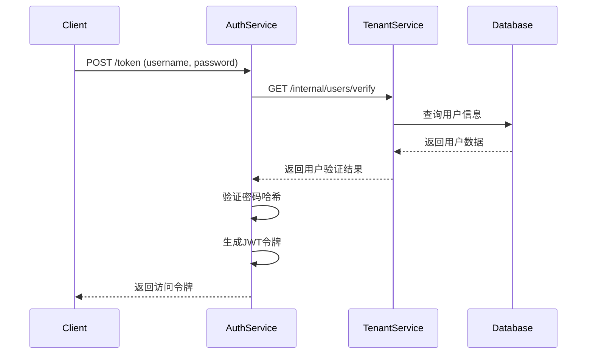

# Auth Service 规范文档

## 🎯 服务概述

Auth Service 是 Lyss AI Platform 的**专用认证服务**，负责用户身份验证、JWT令牌的签发和刷新。本服务专注于认证逻辑，**不处理用户管理、角色分配等业务数据操作**。

## 📋 核心职责

### ✅ 负责的功能
1. **用户身份验证**: 验证用户名/邮箱和密码
2. **JWT令牌签发**: 成功认证后生成JWT访问令牌
3. **JWT令牌刷新**: 处理令牌续期逻辑
4. **密码哈希验证**: 安全验证用户密码
5. **登录日志记录**: 记录认证活动用于安全审计

### ❌ 不负责的功能
- 用户注册和资料管理（由Tenant Service负责）
- 角色和权限分配（由Tenant Service负责）
- 密码重置和邮件发送（由Tenant Service负责）
- 用户会话管理（无状态JWT设计）

## 🔐 认证流程设计

### 登录认证流程


## 📡 对外API接口

### 1. 用户登录
```http
POST /api/v1/auth/token
Content-Type: application/x-www-form-urlencoded
```

**请求体 (OAuth2PasswordRequestForm):**
```
username=user@example.com&password=user_password
```

**成功响应 (200):**
```json
{
  "access_token": "eyJhbGciOiJIUzI1NiIsInR5cCI6IkpXVCJ9...",
  "token_type": "bearer",
  "expires_in": 1800,
  "refresh_token": "refresh_token_string",
  "user_info": {
    "user_id": "uuid",
    "email": "user@example.com",
    "tenant_id": "uuid",
    "role": "end_user"
  }
}
```

**错误响应 (401):**
```json
{
  "success": false,
  "message": "用户名或密码错误",
  "error_code": "INVALID_CREDENTIALS",
  "request_id": "req-20250710143025-a1b2c3d4",
  "timestamp": "2025-07-10T10:30:00Z"
}
```

### 2. 令牌刷新
```http
POST /api/v1/auth/refresh
Content-Type: application/json
Authorization: Bearer <refresh_token>
```

**请求体:**
```json
{
  "refresh_token": "refresh_token_string"
}
```

**成功响应 (200):**
```json
{
  "access_token": "new_access_token",
  "token_type": "bearer", 
  "expires_in": 1800
}
```

### 3. 令牌验证 (内部接口)
```http
POST /internal/auth/verify
Content-Type: application/json
X-Request-ID: {request_id}
```

**请求体:**
```json
{
  "token": "jwt_token_string"
}
```

**成功响应 (200):**
```json
{
  "valid": true,
  "payload": {
    "user_id": "uuid",
    "tenant_id": "uuid",
    "role": "end_user",
    "email": "user@example.com",
    "exp": 1234567890
  }
}
```

## 🔑 JWT令牌设计

### JWT Payload 结构
```json
{
  "user_id": "550e8400-e29b-41d4-a716-446655440000",
  "tenant_id": "550e8400-e29b-41d4-a716-446655440001", 
  "role": "end_user",
  "email": "user@example.com",
  "iss": "lyss-auth-service",
  "aud": "lyss-platform",
  "exp": 1704067200,
  "iat": 1704063600,
  "jti": "token-unique-id"
}
```

### 令牌配置参数
```python
# JWT配置
SECRET_KEY: str = "至少32字符的强密钥"
ALGORITHM: str = "HS256"
ACCESS_TOKEN_EXPIRE_MINUTES: int = 30
REFRESH_TOKEN_EXPIRE_DAYS: int = 7

# 令牌签发者信息
JWT_ISSUER: str = "lyss-auth-service"
JWT_AUDIENCE: str = "lyss-platform"
```

### 安全特性
- **强签名算法**: 使用HS256算法保证令牌完整性
- **过期时间控制**: 访问令牌30分钟，刷新令牌7天
- **唯一标识**: 每个令牌包含唯一的jti字段
- **关键信息加密**: 敏感信息在传输中受TLS保护

## 🏗️ 数据模型设计

### 逻辑数据模型

Auth Service需要查询以下逻辑数据结构（由Tenant Service提供）：

#### users表结构
```sql
-- 逻辑模型：用户基本信息
users: {
  id: UUID PRIMARY KEY,
  email: VARCHAR(255) UNIQUE NOT NULL,
  username: VARCHAR(100) UNIQUE,
  hashed_password: VARCHAR(255) NOT NULL,
  role_id: UUID REFERENCES roles(id),
  tenant_id: UUID NOT NULL,
  is_active: BOOLEAN DEFAULT TRUE,
  last_login_at: TIMESTAMP,
  created_at: TIMESTAMP DEFAULT NOW(),
  updated_at: TIMESTAMP DEFAULT NOW()
}
```

#### roles表结构  
```sql
-- 逻辑模型：角色定义
roles: {
  id: UUID PRIMARY KEY,
  name: VARCHAR(50) NOT NULL, -- 'end_user', 'tenant_admin', 'super_admin'
  description: TEXT,
  permissions: JSONB,
  created_at: TIMESTAMP DEFAULT NOW()
}
```

### 服务间数据访问
Auth Service **不直接访问数据库**，而是通过调用Tenant Service的内部API获取用户信息：

```python
# 用户验证API调用
async def verify_user(username: str) -> UserInfo:
    response = await httpx.post(
        f"{TENANT_SERVICE_URL}/internal/users/verify",
        json={"username": username},
        headers={"X-Request-ID": get_request_id()}
    )
    return UserInfo(**response.json())
```

## 🔧 核心技术实现

### 依赖组件
```python
# requirements.txt
fastapi==0.104.1
uvicorn==0.24.0
python-jose[cryptography]==3.3.0
passlib[bcrypt]==1.7.4
python-multipart==0.0.6
httpx==0.25.0
pydantic==2.5.0
```

### 密码哈希验证
```python
from passlib.context import CryptContext

# 密码上下文配置
pwd_context = CryptContext(
    schemes=["bcrypt"],
    deprecated="auto",
    bcrypt__rounds=12
)

def verify_password(plain_password: str, hashed_password: str) -> bool:
    """验证明文密码与哈希密码是否匹配"""
    return pwd_context.verify(plain_password, hashed_password)
```

### JWT令牌操作
```python
from jose import JWTError, jwt
from datetime import datetime, timedelta

def create_access_token(data: dict) -> str:
    """生成访问令牌"""
    to_encode = data.copy()
    expire = datetime.utcnow() + timedelta(minutes=ACCESS_TOKEN_EXPIRE_MINUTES)
    to_encode.update({
        "exp": expire,
        "iat": datetime.utcnow(),
        "iss": JWT_ISSUER,
        "aud": JWT_AUDIENCE,
        "jti": str(uuid.uuid4())
    })
    return jwt.encode(to_encode, SECRET_KEY, algorithm=ALGORITHM)

def verify_token(token: str) -> dict:
    """验证令牌并返回payload"""
    try:
        payload = jwt.decode(
            token, 
            SECRET_KEY, 
            algorithms=[ALGORITHM],
            audience=JWT_AUDIENCE,
            issuer=JWT_ISSUER
        )
        return payload
    except JWTError:
        raise AuthenticationError("无效的令牌")
```

## 📝 日志规范

### 认证事件日志格式
```json
{
  "timestamp": "2025-07-10T10:30:00Z",
  "level": "INFO",
  "service": "auth_service",
  "request_id": "req-20250710143025-a1b2c3d4",
  "event_type": "user_login",
  "user_id": "user-uuid",
  "tenant_id": "tenant-uuid",
  "email": "user@example.com",
  "ip_address": "192.168.1.100",
  "user_agent": "Mozilla/5.0...",
  "success": true,
  "message": "用户登录成功"
}
```

### 必须记录的事件
- **登录尝试**: 成功和失败的登录尝试
- **令牌签发**: 访问令牌和刷新令牌的生成
- **令牌刷新**: 令牌续期操作
- **令牌验证**: 内部令牌验证请求
- **安全事件**: 异常登录模式、暴力破解尝试

### 安全审计日志
```json
{
  "timestamp": "2025-07-10T10:30:00Z",
  "level": "WARNING", 
  "service": "auth_service",
  "event_type": "suspicious_activity",
  "ip_address": "192.168.1.100",
  "failed_attempts": 5,
  "time_window": "5_minutes",
  "message": "检测到可能的暴力破解攻击"
}
```

## 🔒 安全措施

### 防护机制
1. **速率限制**: 同一IP每分钟最多10次登录尝试
2. **密码强度**: 依赖Tenant Service的密码策略
3. **令牌安全**: JWT使用强签名算法和适当的过期时间
4. **审计日志**: 详细记录所有认证活动

### 环境变量配置
```bash
# JWT安全配置
SECRET_KEY="生产环境使用至少32字符的随机密钥"
ACCESS_TOKEN_EXPIRE_MINUTES=30
REFRESH_TOKEN_EXPIRE_DAYS=7

# 服务发现配置
TENANT_SERVICE_URL="http://localhost:8002"

# 安全配置
MAX_LOGIN_ATTEMPTS=10
RATE_LIMIT_WINDOW=60  # 秒

# 日志配置
LOG_LEVEL=INFO
LOG_FORMAT=json
```

## 🚀 部署和运行

### 启动命令
```bash
cd services/auth
uvicorn main:app --host 0.0.0.0 --port 8001 --reload
```

### 健康检查
```http
GET /health
```

**响应:**
```json
{
  "status": "healthy",
  "timestamp": "2025-07-10T10:30:00Z",
  "version": "1.0.0",
  "dependencies": {
    "tenant_service": "healthy"
  }
}
```

### Docker配置
```dockerfile
FROM python:3.11-slim
WORKDIR /app
COPY requirements.txt .
RUN pip install -r requirements.txt
COPY . .
EXPOSE 8001
CMD ["uvicorn", "main:app", "--host", "0.0.0.0", "--port", "8001"]
```

## ⚠️ 关键约束和限制

### 强制约束
1. **单一职责**: 只处理认证逻辑，不涉及用户数据管理
2. **无状态设计**: 不存储会话状态，完全依赖JWT
3. **服务依赖**: 必须通过API调用Tenant Service获取用户信息
4. **安全优先**: 所有认证失败必须记录和监控

### 性能要求
- **认证延迟**: P95 < 100ms
- **并发处理**: 支持1000并发认证请求
- **可用性**: 99.9%正常运行时间

### 监控指标
- 认证请求总数和成功率
- 令牌签发和验证统计
- 登录失败次数和模式
- 响应时间分布
- 依赖服务健康状态

---

**🔒 安全提醒**: Auth Service处理用户凭证和生成访问令牌，是整个平台的安全基石。任何修改都必须经过严格的安全审查，确保不引入安全漏洞。