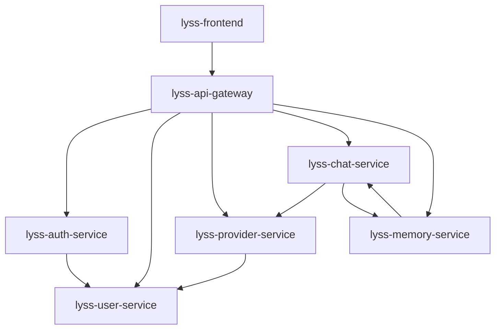

# 服务架构总览

## 📋 文档概述

定义重新设计后的7个核心服务及其职责划分，确保服务边界清晰，职责单一。

---

## 🏗️ 服务命名统一方案

```bash
# 严格按照规范重新命名所有服务
lyss-api-gateway     # 统一入口网关
lyss-auth-service    # 认证服务  
lyss-user-service    # 用户管理服务（从tenant-service分离）
lyss-provider-service # 供应商管理服务（新设计，基于One-API）
lyss-chat-service    # AI对话服务（Go + EINO）
lyss-memory-service  # 智能记忆服务（FastAPI + Mem0AI）
lyss-frontend        # 前端应用
```

---

## 🎯 服务职责划分

### **lyss-api-gateway (统一入口网关)**
```
技术栈: FastAPI + Redis
端口: 8000
职责：
- 统一入口和路由分发
- JWT认证验证
- 请求限流和安全防护
- 跨服务请求追踪
- 错误处理和响应标准化
```

### **lyss-auth-service (认证服务)**
```
技术栈: FastAPI + Redis
端口: 8001
职责：
- 用户登录/登出
- JWT令牌生成和验证
- 会话管理
- 认证状态缓存
```

### **lyss-user-service (用户管理服务)**
```
技术栈: FastAPI + PostgreSQL
端口: 8002
数据库: lyss_user_db
职责：
- 用户注册/管理
- 租户创建/管理
- 角色权限管理
- 多租户数据隔离
- 用户群组管理
```

### **lyss-provider-service (供应商管理服务)**
```
技术栈: FastAPI + PostgreSQL
端口: 8003
数据库: lyss_provider_db
职责：
- Channel管理（个人Channel、群组Channel）
- Token管理和配额控制
- 模型负载均衡和故障转移
- API密钥加密存储
- 供应商健康检查
```

### **lyss-chat-service (AI对话服务)**
```
技术栈: Go + EINO v0.3.52 + PostgreSQL
端口: 8004
数据库: lyss_chat_db
职责：
- EINO框架集成和工作流编排
- 多供应商模型调用 (OpenAI、Anthropic、DeepSeek、Qwen等)
- 流式响应处理 (Server-Sent Events)
- 工具调用支持 (Function Calling)
- 对话历史管理和上下文增强
```

**🔍 技术实现详细说明**:

#### **EINO框架最新API用法**
```go
// 最新EINO API - 基于Context7调研结果
import (
    "github.com/cloudwego/eino/compose"
    "github.com/cloudwego/eino/schema"
    "github.com/cloudwego/eino-ext/components/model/openai"
    "github.com/cloudwego/eino-ext/components/model/deepseek"
)

// 1. 创建AI模型实例
func createChatModel(ctx context.Context, provider string, config map[string]interface{}) (schema.ChatModel, error) {
    switch provider {
    case "openai":
        return openai.NewChatModel(ctx, &openai.ChatModelConfig{
            APIKey:      config["api_key"].(string),
            Model:       config["model"].(string),
            Temperature: config["temperature"].(float32),
            MaxTokens:   config["max_tokens"].(int),
        })
    case "deepseek":
        return deepseek.NewChatModel(ctx, &deepseek.ChatModelConfig{
            APIKey:      config["api_key"].(string),
            Model:       config["model"].(string),
            Temperature: config["temperature"].(float32),
            MaxTokens:   config["max_tokens"].(int),
        })
    }
}

// 2. 构建EINO工作流链
func buildChatChain(ctx context.Context, model schema.ChatModel) (*compose.Chain, error) {
    // 使用最新的Chain API
    chain := compose.NewChain[map[string]any, *schema.Message]()
    
    // 添加聊天模板节点
    chain.AppendChatTemplate(chatTemplate)
    
    // 添加聊天模型节点
    chain.AppendChatModel(model)
    
    return chain.Compile(ctx)
}

// 3. 复杂工作流图编排 (支持工具调用)
func buildAdvancedGraph(ctx context.Context, model schema.ChatModel, tools []tool.BaseTool) (*compose.Graph, error) {
    graph := compose.NewGraph[map[string]any, *schema.Message]()
    
    // 添加各种节点
    graph.AddChatTemplateNode("template", chatTemplate)
    graph.AddChatModelNode("model", model)
    graph.AddToolsNode("tools", toolsNode)
    graph.AddLambdaNode("converter", messageConverter)
    
    // 定义边和分支
    graph.AddEdge(compose.START, "template")
    graph.AddEdge("template", "model")
    graph.AddBranch("model", branchFunc) // 条件分支
    graph.AddEdge("tools", "converter")
    graph.AddEdge("converter", compose.END)
    
    return graph.Compile(ctx)
}

// 4. 流式响应处理
func handleStreamingChat(ctx context.Context, graph *compose.Graph, userInput string) (<-chan string, error) {
    resultChan := make(chan string, 100)
    
    go func() {
        defer close(resultChan)
        
        // 使用EINO处理流式响应
        stream, err := graph.Stream(ctx, map[string]any{
            "query": userInput,
        })
        if err != nil {
            return
        }
        
        for chunk := range stream {
            if content, ok := chunk.(*schema.Message); ok {
                resultChan <- content.Content
            }
        }
    }()
    
    return resultChan, nil
}
```

#### **关键技术改进**
- **编译错误修复**: 使用`compose.NewChain`和`compose.NewGraph`替代过时的API
- **流式响应**: 正确使用`Stream()`方法处理实时响应
- **多供应商支持**: 通过eino-ext扩展库支持多种AI模型
- **工作流编排**: 支持复杂的条件分支和工具调用

### **lyss-memory-service (智能记忆服务)**
```
技术栈: FastAPI + Mem0AI + Qdrant + PostgreSQL
端口: 8005
数据库: lyss_memory_db
职责：
- Mem0AI集成和记忆管理
- 对话历史智能存储
- 语义记忆检索和增强
- 个性化上下文生成
- 记忆关联分析和用户画像
```

**🔍 技术实现详细说明**:

#### **Mem0AI最新集成方案**
```python
# 基于Context7调研的Mem0AI最佳实践
import os
from typing import List, Dict, Optional
from mem0 import Memory, MemoryClient
from fastapi import FastAPI, HTTPException, Depends
from pydantic import BaseModel

# 1. Mem0AI配置和初始化
def create_memory_client() -> Memory:
    """创建配置优化的Mem0AI客户端"""
    config = {
        "vector_store": {
            "provider": "qdrant",
            "config": {
                "collection_name": "lyss_memories",
                "host": os.getenv("QDRANT_HOST", "localhost"),
                "port": int(os.getenv("QDRANT_PORT", 6333)),
                "embedding_model_dims": 1536,  # OpenAI text-embedding-3-small
                "metric": "cosine"
            }
        },
        "llm": {
            "provider": "openai",
            "config": {
                "model": "gpt-4o-mini",
                "temperature": 0.1,
                "max_tokens": 2000,
            }
        },
        "embedder": {
            "provider": "openai",
            "config": {
                "model": "text-embedding-3-small"
            }
        }
    }
    
    return Memory.from_config(config)

# 2. 数据模型定义
class MemoryAddRequest(BaseModel):
    messages: List[Dict[str, str]]  # 对话消息列表
    user_id: str
    agent_id: Optional[str] = None
    metadata: Optional[Dict] = None

class MemorySearchRequest(BaseModel):
    query: str
    user_id: str
    limit: int = 5
    filters: Optional[Dict] = None

class MemoryResponse(BaseModel):
    memory_id: str
    content: str
    relevance_score: float
    created_at: str
    metadata: Dict

# 3. 核心业务逻辑
class MemoryService:
    def __init__(self):
        self.memory_client = create_memory_client()
    
    async def add_conversation_memory(self, request: MemoryAddRequest) -> Dict:
        """添加对话记忆"""
        try:
            # 使用Mem0AI处理多轮对话
            result = self.memory_client.add(
                messages=request.messages,
                user_id=request.user_id,
                agent_id=request.agent_id,
                metadata={
                    "source": "conversation",
                    "timestamp": datetime.utcnow().isoformat(),
                    **request.metadata or {}
                }
            )
            
            return {
                "success": True,
                "memory_id": result.get("id"),
                "message": "记忆添加成功"
            }
        except Exception as e:
            raise HTTPException(status_code=500, detail=f"记忆添加失败: {str(e)}")
    
    async def search_memories(self, request: MemorySearchRequest) -> List[MemoryResponse]:
        """智能记忆检索"""
        try:
            # 使用Mem0AI进行语义搜索
            results = self.memory_client.search(
                query=request.query,
                user_id=request.user_id,
                limit=request.limit
            )
            
            memories = []
            for result in results:
                memories.append(MemoryResponse(
                    memory_id=result["id"],
                    content=result["memory"],
                    relevance_score=result.get("score", 0.0),
                    created_at=result.get("created_at", ""),
                    metadata=result.get("metadata", {})
                ))
            
            return memories
        except Exception as e:
            raise HTTPException(status_code=500, detail=f"记忆检索失败: {str(e)}")
    
    async def get_user_context(self, user_id: str, recent_message: str) -> str:
        """获取用户个性化上下文"""
        try:
            # 检索相关记忆
            relevant_memories = await self.search_memories(
                MemorySearchRequest(
                    query=recent_message,
                    user_id=user_id,
                    limit=3
                )
            )
            
            # 构建上下文
            context_parts = []
            for memory in relevant_memories:
                context_parts.append(f"- {memory.content}")
            
            if context_parts:
                return f"用户相关记忆:\n" + "\n".join(context_parts)
            else:
                return "暂无相关历史记忆"
                
        except Exception as e:
            return "记忆检索失败"

# 4. FastAPI路由定义
app = FastAPI(title="Lyss Memory Service")
memory_service = MemoryService()

@app.post("/api/v1/memories", response_model=Dict)
async def add_memory(request: MemoryAddRequest):
    """添加记忆接口"""
    return await memory_service.add_conversation_memory(request)

@app.get("/api/v1/memories/search", response_model=List[MemoryResponse])
async def search_memories(
    query: str,
    user_id: str,
    limit: int = 5
):
    """搜索记忆接口"""
    request = MemorySearchRequest(query=query, user_id=user_id, limit=limit)
    return await memory_service.search_memories(request)

@app.get("/api/v1/memories/context/{user_id}")
async def get_context(user_id: str, message: str):
    """获取用户上下文接口"""
    context = await memory_service.get_user_context(user_id, message)
    return {"context": context}
```

#### **高级记忆管理功能**
```python
# 5. 高级记忆功能
class AdvancedMemoryService(MemoryService):
    
    async def create_user_profile(self, user_id: str) -> Dict:
        """生成用户画像"""
        try:
            # 获取用户所有记忆
            all_memories = self.memory_client.get_all(user_id=user_id)
            
            if not all_memories.get("results"):
                return {"profile": "新用户，暂无足够数据生成画像"}
            
            # 使用Mem0AI分析用户偏好
            profile_query = "总结这个用户的兴趣爱好、工作情况和个人偏好"
            profile_memories = self.memory_client.search(
                query=profile_query,
                user_id=user_id,
                limit=10
            )
            
            # 构建用户画像
            profile_parts = []
            for memory in profile_memories:
                profile_parts.append(memory["memory"])
            
            return {
                "user_id": user_id,
                "total_memories": len(all_memories["results"]),
                "profile_summary": "\n".join(profile_parts[:5]),
                "generated_at": datetime.utcnow().isoformat()
            }
            
        except Exception as e:
            raise HTTPException(status_code=500, detail=f"用户画像生成失败: {str(e)}")
    
    async def cleanup_old_memories(self, user_id: str, days_old: int = 90) -> Dict:
        """清理过期记忆"""
        try:
            # 计算截止日期
            cutoff_date = datetime.utcnow() - timedelta(days=days_old)
            
            # 获取所有记忆
            all_memories = self.memory_client.get_all(user_id=user_id)
            old_memories = []
            
            for memory in all_memories.get("results", []):
                created_at = datetime.fromisoformat(
                    memory.get("created_at", "").replace("Z", "+00:00")
                )
                if created_at < cutoff_date:
                    old_memories.append(memory["id"])
            
            # 删除过期记忆
            deleted_count = 0
            for memory_id in old_memories:
                try:
                    self.memory_client.delete(memory_id=memory_id)
                    deleted_count += 1
                except:
                    continue
            
            return {
                "deleted_count": deleted_count,
                "total_old_memories": len(old_memories),
                "cleanup_date": cutoff_date.isoformat()
            }
            
        except Exception as e:
            raise HTTPException(status_code=500, detail=f"记忆清理失败: {str(e)}")
```

#### **关键技术优势**
- **向量检索**: 使用Qdrant进行高效语义搜索
- **智能总结**: Mem0AI自动提取和总结对话要点
- **个性化**: 基于历史记忆生成个性化回复上下文
- **多模态支持**: 支持文本、图片等多种内容类型的记忆
- **可扩展性**: 支持大规模用户和海量记忆数据

### **lyss-frontend (前端应用)**
```
技术栈: React 18 + TypeScript + Ant Design X
端口: 3000
职责：
- 现代化AI对话界面
- 对话历史侧边栏
- 供应商和模型管理界面
- 用户偏好设置
- 响应式设计
```

**🔍 技术实现详细说明**:

#### **Ant Design X最新集成方案**
```typescript
// 基于Context7调研的Ant Design X最佳实践
import React, { useState, useCallback, useEffect } from 'react';
import { 
  useXChat, 
  useXAgent, 
  Bubble, 
  Sender,
  Conversations,
  XProvider,
  Welcome
} from '@ant-design/x';
import { ConfigProvider, Layout, theme } from 'antd';
import { UserOutlined, RobotOutlined } from '@ant-design/icons';

import { chatService } from '@/services/chat';
import { useAuth } from '@/hooks/useAuth';

const { Content, Sider } = Layout;

// 1. 全局对话配置和类型定义
interface ChatMessage {
  id: string;
  content: string;
  role: 'user' | 'assistant';
  timestamp: Date;
  status?: 'sending' | 'success' | 'error';
}

interface ChatSession {
  id: string;
  title: string;
  messages: ChatMessage[];
  createdAt: Date;
  updatedAt: Date;
}

// 2. 主对话组件实现
const ChatMainPage: React.FC = () => {
  const { user } = useAuth();
  const [sessions, setSessions] = useState<ChatSession[]>([]);
  const [currentSessionId, setCurrentSessionId] = useState<string | null>(null);
  const [sidebarCollapsed, setSidebarCollapsed] = useState(false);
  
  // 使用Ant Design X的核心Hooks
  const chat = useXChat({
    defaultMessages: [],
    onMessagesChange: handleMessagesChange,
  });
  
  const agent = useXAgent({
    request: async (messages, options) => {
      // 调用后端聊天服务
      return await chatService.sendMessage({
        messages,
        conversationId: currentSessionId,
        stream: true,
        ...options,
      });
    },
    onError: (error) => {
      console.error('聊天请求失败:', error);
      // 错误处理逻辑
    },
  });
  
  // 处理消息变化
  const handleMessagesChange = useCallback((messages: ChatMessage[]) => {
    if (currentSessionId) {
      setSessions(prev => prev.map(session => 
        session.id === currentSessionId 
          ? { ...session, messages, updatedAt: new Date() }
          : session
      ));
    }
  }, [currentSessionId]);
  
  // 创建新对话
  const createNewSession = useCallback(async () => {
    const newSession: ChatSession = {
      id: `session-${Date.now()}`,
      title: '新对话',
      messages: [],
      createdAt: new Date(),
      updatedAt: new Date(),
    };
    
    setSessions(prev => [newSession, ...prev]);
    setCurrentSessionId(newSession.id);
    chat.setMessages([]);
  }, [chat]);
  
  // 切换对话会话
  const switchSession = useCallback((sessionId: string) => {
    const session = sessions.find(s => s.id === sessionId);
    if (session) {
      setCurrentSessionId(sessionId);
      chat.setMessages(session.messages);
    }
  }, [sessions, chat]);
  
  // 发送消息处理
  const handleSendMessage = useCallback(async (content: string) => {
    if (!currentSessionId || !content.trim()) return;
    
    try {
      // 添加用户消息
      const userMessage: ChatMessage = {
        id: `msg-${Date.now()}`,
        content: content.trim(),
        role: 'user',
        timestamp: new Date(),
        status: 'success',
      };
      
      chat.pushMessage(userMessage);
      
      // 调用AI代理处理
      await agent.request([...chat.messages, userMessage], {
        model: 'gpt-4',
        temperature: 0.7,
      });
      
    } catch (error) {
      console.error('发送消息失败:', error);
      // 错误提示处理
    }
  }, [currentSessionId, chat, agent]);
  
  return (
    <XProvider>
      <ConfigProvider
        theme={{
          algorithm: theme.defaultAlgorithm,
          token: {
            colorPrimary: '#1890ff',
            borderRadius: 8,
          },
        }}
      >
        <Layout className="chat-layout" style={{ height: '100vh' }}>
          {/* 左侧对话历史侧边栏 */}
          <Sider 
            width={280}
            collapsible
            collapsed={sidebarCollapsed}
            onCollapse={setSidebarCollapsed}
            className="chat-sidebar"
          >
            <Conversations
              items={sessions.map(session => ({
                key: session.id,
                label: session.title,
                timestamp: session.updatedAt,
                active: session.id === currentSessionId,
              }))}
              onActiveChange={(key) => switchSession(key as string)}
              onAdd={createNewSession}
              className="conversations-list"
            />
          </Sider>
          
          {/* 主对话区域 */}
          <Content className="chat-content">
            {currentSessionId ? (
              <div className="chat-container">
                {/* 对话消息列表 */}
                <div className="chat-messages">
                  {chat.messages.length === 0 ? (
                    <Welcome
                      title={`欢迎使用 Lyss AI 平台`}
                      description="请开始您的对话"
                      extra={
                        <div className="welcome-suggestions">
                          <button onClick={() => handleSendMessage('你好，请介绍一下你的功能')}>
                            了解功能
                          </button>
                          <button onClick={() => handleSendMessage('帮我写一段Python代码')}>
                            代码协助
                          </button>
                        </div>
                      }
                    />
                  ) : (
                    <Bubble.List
                      items={chat.messages.map(msg => ({
                        key: msg.id,
                        role: msg.role,
                        content: msg.content,
                        avatar: msg.role === 'user' 
                          ? { icon: <UserOutlined /> }
                          : { icon: <RobotOutlined /> },
                        status: msg.status,
                        timestamp: msg.timestamp,
                      }))}
                      className="bubble-list"
                    />
                  )}
                </div>
                
                {/* 消息输入区域 */}
                <div className="chat-input">
                  <Sender
                    value=""
                    placeholder="输入您的消息..."
                    onSubmit={handleSendMessage}
                    loading={agent.isRequesting}
                    disabled={!currentSessionId}
                    actions={[
                      {
                        key: 'clear',
                        label: '清空对话',
                        onClick: () => chat.setMessages([]),
                      },
                    ]}
                    className="message-sender"
                  />
                </div>
              </div>
            ) : (
              <Welcome
                title="选择或创建新对话"
                description="从左侧选择一个对话，或创建新的对话开始"
                extra={
                  <button onClick={createNewSession}>
                    创建新对话
                  </button>
                }
              />
            )}
          </Content>
        </Layout>
      </ConfigProvider>
    </XProvider>
  );
};

// 3. 高级聊天功能组件
const AdvancedChatFeatures: React.FC = () => {
  const [streamingText, setStreamingText] = useState('');
  const [isStreaming, setIsStreaming] = useState(false);
  
  // 流式响应处理
  const handleStreamingResponse = useCallback(async (response: ReadableStream) => {
    setIsStreaming(true);
    const reader = response.getReader();
    const decoder = new TextDecoder();
    
    try {
      while (true) {
        const { done, value } = await reader.read();
        if (done) break;
        
        const chunk = decoder.decode(value);
        setStreamingText(prev => prev + chunk);
      }
    } catch (error) {
      console.error('流式响应处理失败:', error);
    } finally {
      setIsStreaming(false);
    }
  }, []);
  
  // 智能提示和自动补全
  const suggestions = [
    '帮我写一个React组件',
    '解释一下这段代码的功能',
    '优化这个SQL查询',
    '检查代码中的潜在问题',
  ];
  
  return (
    <div className="advanced-chat-features">
      {/* 流式响应展示 */}
      {isStreaming && (
        <Bubble
          content={streamingText}
          avatar={{ icon: <RobotOutlined /> }}
          className="streaming-bubble"
        />
      )}
      
      {/* 快捷建议 */}
      <div className="chat-suggestions">
        {suggestions.map((suggestion, index) => (
          <button
            key={index}
            className="suggestion-button"
            onClick={() => handleSendMessage(suggestion)}
          >
            {suggestion}
          </button>
        ))}
      </div>
    </div>
  );
};

// 4. 对话管理Hook
export const useConversationManager = () => {
  const [conversations, setConversations] = useState<ChatSession[]>([]);
  const [activeConversationId, setActiveConversationId] = useState<string | null>(null);
  
  const createConversation = useCallback(async (title?: string) => {
    const newConversation: ChatSession = {
      id: `conv-${Date.now()}`,
      title: title || `对话 ${conversations.length + 1}`,
      messages: [],
      createdAt: new Date(),
      updatedAt: new Date(),
    };
    
    setConversations(prev => [newConversation, ...prev]);
    setActiveConversationId(newConversation.id);
    
    return newConversation;
  }, [conversations.length]);
  
  const deleteConversation = useCallback(async (conversationId: string) => {
    setConversations(prev => prev.filter(conv => conv.id !== conversationId));
    
    if (activeConversationId === conversationId) {
      const remaining = conversations.filter(conv => conv.id !== conversationId);
      setActiveConversationId(remaining.length > 0 ? remaining[0].id : null);
    }
  }, [activeConversationId, conversations]);
  
  const updateConversationTitle = useCallback(async (conversationId: string, title: string) => {
    setConversations(prev => prev.map(conv => 
      conv.id === conversationId 
        ? { ...conv, title, updatedAt: new Date() }
        : conv
    ));
  }, []);
  
  return {
    conversations,
    activeConversationId,
    setActiveConversationId,
    createConversation,
    deleteConversation,
    updateConversationTitle,
  };
};

export default ChatMainPage;
```

#### **样式定制和主题配置**
```css
/* Chat组件自定义样式 */
.chat-layout {
  background: #f5f5f5;
}

.chat-sidebar {
  background: #fff;
  border-right: 1px solid #f0f0f0;
  overflow-y: auto;
}

.conversations-list {
  padding: 16px 8px;
}

.chat-content {
  display: flex;
  flex-direction: column;
  background: #fff;
}

.chat-container {
  display: flex;
  flex-direction: column;
  height: 100%;
}

.chat-messages {
  flex: 1;
  padding: 16px;
  overflow-y: auto;
  background: linear-gradient(180deg, #fafafa 0%, #fff 100%);
}

.bubble-list {
  max-width: 800px;
  margin: 0 auto;
}

.chat-input {
  padding: 16px;
  border-top: 1px solid #f0f0f0;
  background: #fff;
}

.message-sender {
  max-width: 800px;
  margin: 0 auto;
}

.streaming-bubble {
  animation: pulse 1.5s ease-in-out infinite;
}

@keyframes pulse {
  0%, 100% { opacity: 1; }
  50% { opacity: 0.7; }
}

.welcome-suggestions, .chat-suggestions {
  display: flex;
  gap: 8px;
  flex-wrap: wrap;
  margin-top: 16px;
}

.suggestion-button {
  padding: 8px 16px;
  border: 1px solid #d9d9d9;
  border-radius: 6px;
  background: #fff;
  cursor: pointer;
  transition: all 0.2s;
}

.suggestion-button:hover {
  border-color: #1890ff;
  color: #1890ff;
}
```

#### **关键技术优势**
- **现代化UI**: 使用Ant Design X提供的最新聊天组件
- **流式响应**: 支持实时流式AI回复显示
- **智能交互**: useXChat和useXAgent提供强大的对话管理
- **响应式设计**: 自适应各种屏幕尺寸
- **可扩展架构**: 易于添加新功能和自定义组件

---

## 🔗 服务依赖关系



---

## 📊 服务通信方式

### **同步调用 (HTTP REST)**
- API Gateway → 各个后端服务
- Chat Service → Provider Service (获取模型配置)
- Chat Service → Memory Service (增强提示词)

### **异步处理**
- 对话记忆存储 (Chat → Memory)
- 配额统计更新 (Provider Service)
- 审计日志记录

### **缓存策略**
- Redis缓存用户认证状态
- Redis缓存Provider配置信息
- Redis缓存热点对话数据

---

## 🎯 设计原则

1. **单一职责** - 每个服务专注一个业务领域
2. **数据独立** - 服务拥有独立的数据库
3. **API优先** - 服务间通过REST API通信
4. **无状态设计** - 便于水平扩展
5. **故障隔离** - 单个服务故障不影响整体系统