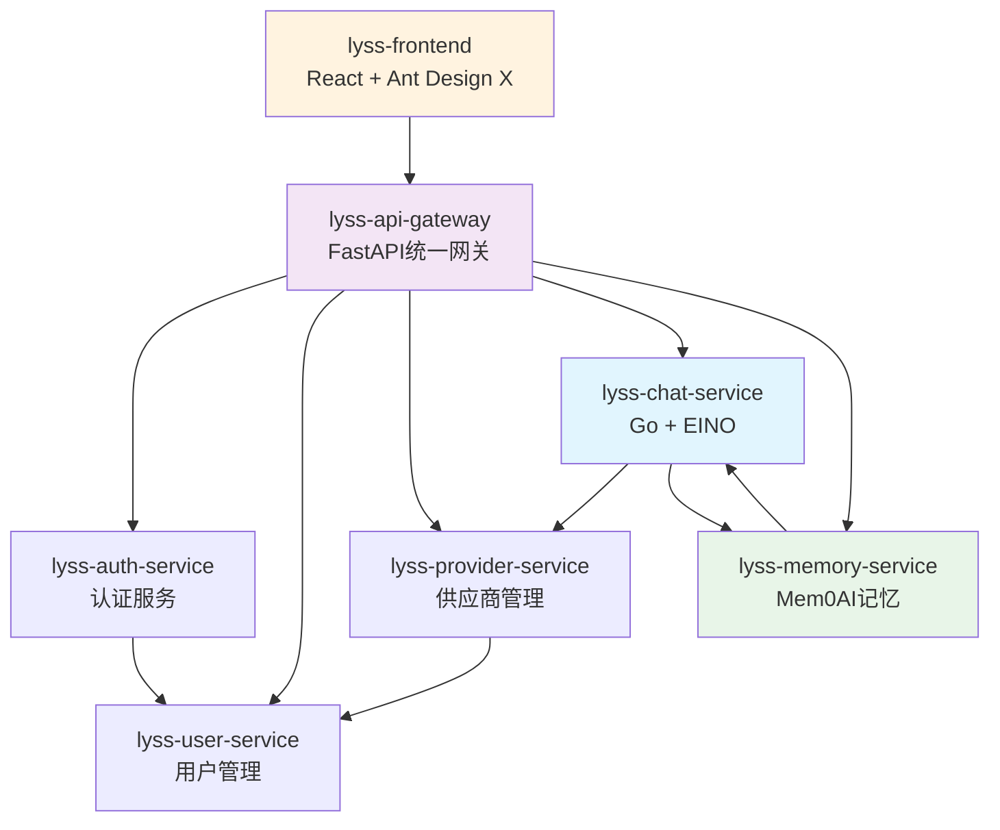

# 服务架构总览

## 📋 文档概述

定义重新设计后的7个核心服务及其职责划分，确保服务边界清晰，职责单一。

> **📚 详细文档**: 每个服务的完整技术实现请参考 [services/](./services/) 目录下的独立文档。

---

## 🏗️ 服务命名统一方案

```bash
# 严格按照规范重新命名所有服务
lyss-api-gateway     # 统一入口网关
lyss-auth-service    # 认证服务  
lyss-user-service    # 用户管理服务（从tenant-service分离）
lyss-provider-service # 供应商管理服务（新设计，基于One-API）
lyss-chat-service    # AI对话服务（Go + EINO）
lyss-memory-service  # 智能记忆服务（FastAPI + Mem0AI）
lyss-frontend        # 前端应用
```

---

## 🎯 服务职责快速概览

| 服务名称 | 端口 | 技术栈 | 核心职责 | 文档链接 |
|---------|------|--------|----------|----------|
| **lyss-api-gateway** | 8000 | FastAPI + Redis | 统一入口、路由分发、认证验证 | [📖 详细文档](./services/lyss-api-gateway.md) |
| **lyss-auth-service** | 8001 | FastAPI + Redis | 用户认证、JWT管理、会话管理 | [📖 详细文档](./services/lyss-auth-service.md) *(待补充)* |
| **lyss-user-service** | 8002 | FastAPI + PostgreSQL | 用户管理、租户管理、权限控制 | [📖 详细文档](./services/lyss-user-service.md) *(待补充)* |
| **lyss-provider-service** | 8003 | FastAPI + PostgreSQL | Channel管理、Token管理、负载均衡 | [📖 详细文档](./services/lyss-provider-service.md) *(待补充)* |
| **lyss-chat-service** | 8004 | Go + EINO + PostgreSQL | AI对话、工作流编排、流式响应 | [📖 详细文档](./services/lyss-chat-service.md) |
| **lyss-memory-service** | 8005 | FastAPI + Mem0AI + Qdrant | 智能记忆、语义检索、用户画像 | [📖 详细文档](./services/lyss-memory-service.md) |
| **lyss-frontend** | 3000 | React + TypeScript + Ant Design X | 对话界面、管理界面、响应式设计 | [📖 详细文档](./services/lyss-frontend.md) |

---

## 🔗 服务依赖关系



---

## 📊 技术栈分布

### **Python (FastAPI) 生态**
- **lyss-api-gateway**: 网关路由、中间件、代理转发
- **lyss-auth-service**: JWT认证、Redis会话
- **lyss-user-service**: PostgreSQL数据管理、多租户隔离
- **lyss-provider-service**: 供应商API管理、配额控制
- **lyss-memory-service**: Mem0AI集成、Qdrant向量检索

### **Go 生态**
- **lyss-chat-service**: EINO工作流、高性能对话处理、流式响应

### **前端生态**
- **lyss-frontend**: React 18、TypeScript、Ant Design X现代化界面

---

## 🚀 核心技术特色

### **🤖 AI能力集成**
- **Chat Service**: [EINO v0.3.52框架](./services/lyss-chat-service.md#eino框架最新api用法) - 多供应商模型编排
- **Memory Service**: [Mem0AI智能记忆](./services/lyss-memory-service.md#mem0ai最新集成方案) - 对话记忆和语义检索
- **Frontend**: [Ant Design X聊天组件](./services/lyss-frontend.md#ant-design-x最新集成方案) - 现代化对话界面

### **🏗️ 基础架构**
- **API Gateway**: 统一入口、认证中间件、服务代理
- **Multi-tenant**: 数据库级隔离 + 表级隔离混合模式
- **Caching**: Redis多层缓存策略

### **📊 数据层设计**
- **PostgreSQL**: 每服务独立数据库，确保数据隔离
- **Qdrant**: 向量数据库，支持语义搜索
- **Redis**: 分布式缓存和会话管理

---

## 📋 开发状态总览

### **✅ 已完成设计 (80%)**
- [x] **lyss-chat-service**: EINO集成、Go实现、流式响应
- [x] **lyss-memory-service**: Mem0AI集成、向量检索、用户画像
- [x] **lyss-frontend**: Ant Design X集成、现代化界面
- [x] **lyss-api-gateway**: 基础网关架构、路由代理

### **🚧 待补充设计 (20%)**
- [ ] **lyss-auth-service**: 认证流程、JWT管理详细实现
- [ ] **lyss-user-service**: 用户管理、租户隔离详细实现  
- [ ] **lyss-provider-service**: 供应商管理、One-API集成

---

## 🎯 设计原则

1. **单一职责** - 每个服务专注一个业务领域
2. **数据独立** - 服务拥有独立的数据库
3. **API优先** - 服务间通过REST API通信
4. **无状态设计** - 便于水平扩展
5. **故障隔离** - 单个服务故障不影响整体系统

---

## 📚 相关文档

- **[服务详细实现](./services/)** - 每个服务的完整技术文档
- **[数据库设计](./database-design.md)** - 数据库架构和表结构设计
- **[部署配置](./deployment-setup.md)** - Docker和环境配置
- **[编码规范](../standards/coding-standards/)** - 代码规范和最佳实践

---

## 📝 文档维护说明

本文档作为服务架构的快速概览，详细的技术实现请参考各服务的独立文档：

- 如需了解**具体实现细节**，请查看对应服务的详细文档
- 如需**修改技术实现**，请直接编辑对应服务的文档文件
- 如需**更新架构概览**，请修改本文档

这种文档组织方式确保了：
- **概览清晰**: 快速了解整体架构
- **细节完整**: 每个服务有完整的技术文档
- **维护便利**: 避免重复内容，便于独立维护