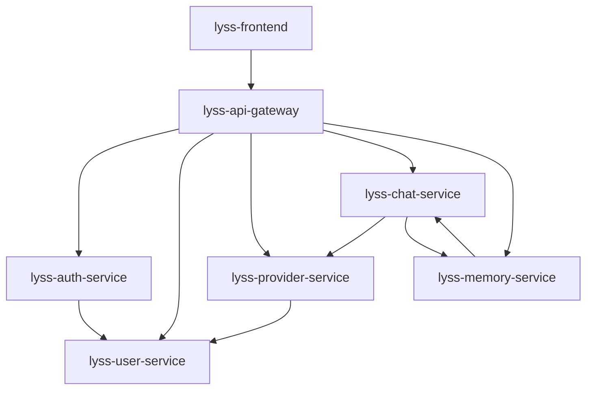

# 服务架构总览

## 📋 文档概述

定义重新设计后的7个核心服务及其职责划分，确保服务边界清晰，职责单一。

---

## 🏗️ 服务命名统一方案

```bash
# 严格按照规范重新命名所有服务
lyss-api-gateway     # 统一入口网关
lyss-auth-service    # 认证服务  
lyss-user-service    # 用户管理服务（从tenant-service分离）
lyss-provider-service # 供应商管理服务（新设计，基于One-API）
lyss-chat-service    # AI对话服务（Go + EINO）
lyss-memory-service  # 智能记忆服务（FastAPI + Mem0AI）
lyss-frontend        # 前端应用
```

---

## 🎯 服务职责划分

### **lyss-api-gateway (统一入口网关)**
```
技术栈: FastAPI + Redis
端口: 8000
职责：
- 统一入口和路由分发
- JWT认证验证
- 请求限流和安全防护
- 跨服务请求追踪
- 错误处理和响应标准化
```

### **lyss-auth-service (认证服务)**
```
技术栈: FastAPI + Redis
端口: 8001
职责：
- 用户登录/登出
- JWT令牌生成和验证
- 会话管理
- 认证状态缓存
```

### **lyss-user-service (用户管理服务)**
```
技术栈: FastAPI + PostgreSQL
端口: 8002
数据库: lyss_user_db
职责：
- 用户注册/管理
- 租户创建/管理
- 角色权限管理
- 多租户数据隔离
- 用户群组管理
```

### **lyss-provider-service (供应商管理服务)**
```
技术栈: FastAPI + PostgreSQL
端口: 8003
数据库: lyss_provider_db
职责：
- Channel管理（个人Channel、群组Channel）
- Token管理和配额控制
- 模型负载均衡和故障转移
- API密钥加密存储
- 供应商健康检查
```

### **lyss-chat-service (AI对话服务)**
```
技术栈: Go + EINO + PostgreSQL
端口: 8004
数据库: lyss_chat_db
职责：
- EINO框架集成
- 多供应商模型调用
- 流式响应处理
- 工具调用支持
- 对话历史管理
```

### **lyss-memory-service (智能记忆服务)**
```
技术栈: FastAPI + Mem0AI + Qdrant + PostgreSQL
端口: 8005
数据库: lyss_memory_db
职责：
- Mem0AI集成
- 对话历史管理
- 智能记忆检索
- 个性化上下文增强
- 记忆关联分析
```

### **lyss-frontend (前端应用)**
```
技术栈: React 18 + TypeScript + Ant Design X
端口: 3000
职责：
- 现代化AI对话界面
- 对话历史侧边栏
- 供应商和模型管理界面
- 用户偏好设置
- 响应式设计
```

---

## 🔗 服务依赖关系



---

## 📊 服务通信方式

### **同步调用 (HTTP REST)**
- API Gateway → 各个后端服务
- Chat Service → Provider Service (获取模型配置)
- Chat Service → Memory Service (增强提示词)

### **异步处理**
- 对话记忆存储 (Chat → Memory)
- 配额统计更新 (Provider Service)
- 审计日志记录

### **缓存策略**
- Redis缓存用户认证状态
- Redis缓存Provider配置信息
- Redis缓存热点对话数据

---

## 🎯 设计原则

1. **单一职责** - 每个服务专注一个业务领域
2. **数据独立** - 服务拥有独立的数据库
3. **API优先** - 服务间通过REST API通信
4. **无状态设计** - 便于水平扩展
5. **故障隔离** - 单个服务故障不影响整体系统