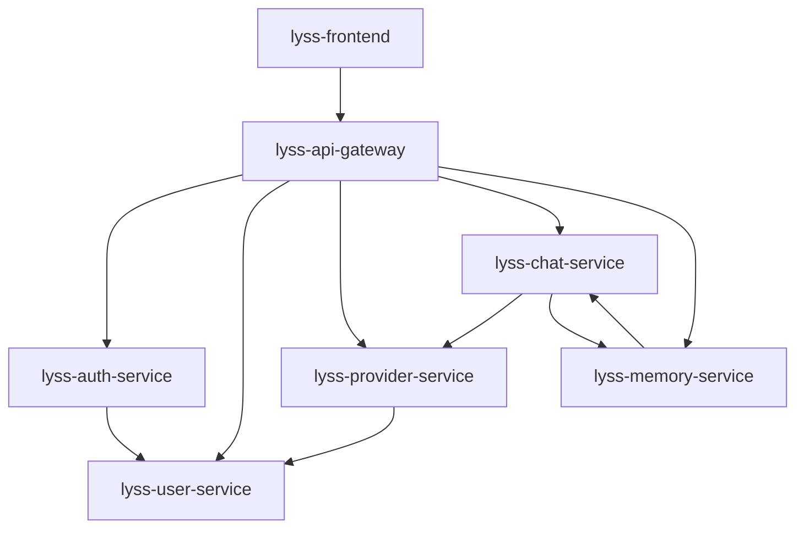

# 服务架构详细文档

## 📋 目录概述

本目录包含Lyss AI平台7个核心服务的详细技术实现文档，每个服务都有独立的设计和实现说明。

---

## 🏗️ 服务列表

### **核心基础服务**

#### **[lyss-api-gateway](./lyss-api-gateway.md)** - 统一入口网关
- **端口**: 8000
- **技术栈**: FastAPI + Redis
- **核心功能**: 路由分发、认证验证、安全防护、请求追踪
- **关键特性**: 统一入口、中间件支持、服务代理

#### **[lyss-auth-service](./lyss-auth-service.md)** - 认证服务 *(待补充)*
- **端口**: 8001  
- **技术栈**: FastAPI + Redis
- **核心功能**: 用户登录/登出、JWT令牌管理、会话管理
- **关键特性**: 安全认证、令牌验证、状态缓存

#### **[lyss-user-service](./lyss-user-service.md)** - 用户管理服务 *(待补充)*
- **端口**: 8002
- **技术栈**: FastAPI + PostgreSQL
- **核心功能**: 用户注册/管理、租户管理、权限控制
- **关键特性**: 多租户隔离、角色管理、数据安全

### **业务核心服务**

#### **[lyss-provider-service](./lyss-provider-service.md)** - 供应商管理服务 *(待补充)*
- **端口**: 8003
- **技术栈**: FastAPI + PostgreSQL
- **核心功能**: Channel管理、Token管理、模型负载均衡
- **关键特性**: 多供应商支持、配额控制、故障转移

#### **[lyss-chat-service](./lyss-chat-service.md)** - AI对话服务
- **端口**: 8004
- **技术栈**: Go + EINO v0.3.52 + PostgreSQL
- **核心功能**: 工作流编排、多供应商调用、流式响应、工具调用
- **关键特性**: EINO集成、实时响应、多模型支持

#### **[lyss-memory-service](./lyss-memory-service.md)** - 智能记忆服务
- **端口**: 8005
- **技术栈**: FastAPI + Mem0AI + Qdrant + PostgreSQL
- **核心功能**: 记忆管理、语义检索、个性化上下文、用户画像
- **关键特性**: Mem0AI集成、向量检索、智能分析

### **前端应用**

#### **[lyss-frontend](./lyss-frontend.md)** - 前端应用
- **端口**: 3000
- **技术栈**: React 18 + TypeScript + Ant Design X
- **核心功能**: AI对话界面、对话历史、管理界面、响应式设计
- **关键特性**: 现代化UI、实时交互、组件化架构

---

## 🔗 服务依赖关系

---

## 🚀 快速导航

### **按技术栈查看**
- **Python/FastAPI服务**: [API Gateway](./lyss-api-gateway.md) | [Auth Service](./lyss-auth-service.md) | [User Service](./lyss-user-service.md) | [Provider Service](./lyss-provider-service.md) | [Memory Service](./lyss-memory-service.md)
- **Go服务**: [Chat Service](./lyss-chat-service.md)
- **前端应用**: [Frontend](./lyss-frontend.md)

### **按功能领域查看**
- **基础设施**: [API Gateway](./lyss-api-gateway.md) | [Auth Service](./lyss-auth-service.md) | [User Service](./lyss-user-service.md)
- **AI核心**: [Chat Service](./lyss-chat-service.md) | [Memory Service](./lyss-memory-service.md) | [Provider Service](./lyss-provider-service.md)
- **用户界面**: [Frontend](./lyss-frontend.md)

### **按开发优先级查看**
1. **高优先级** (已完成): [Chat Service](./lyss-chat-service.md) | [Memory Service](./lyss-memory-service.md) | [Frontend](./lyss-frontend.md)
2. **中优先级** (已完成): [API Gateway](./lyss-api-gateway.md)
3. **待补充**: Auth Service | User Service | Provider Service

---

## 📊 服务通信方式

### **同步调用 (HTTP REST)**
- API Gateway → 各个后端服务
- Chat Service → Provider Service (获取模型配置)
- Chat Service → Memory Service (增强提示词)

### **异步处理**
- 对话记忆存储 (Chat → Memory)
- 配额统计更新 (Provider Service)
- 审计日志记录

### **缓存策略**
- Redis缓存用户认证状态
- Redis缓存Provider配置信息
- Redis缓存热点对话数据

---

## 🎯 设计原则

1. **单一职责** - 每个服务专注一个业务领域
2. **数据独立** - 服务拥有独立的数据库
3. **API优先** - 服务间通过REST API通信
4. **无状态设计** - 便于水平扩展
5. **故障隔离** - 单个服务故障不影响整体系统

---

## 📋 文档维护

### **文档状态**
- ✅ **已完成**: Chat Service、Memory Service、Frontend、API Gateway
- 🚧 **待补充**: Auth Service、User Service、Provider Service

### **更新记录**
- 2025-01-20: 完成Chat Service和Memory Service的详细技术实现
- 2025-01-20: 完成Frontend的Ant Design X集成方案
- 2025-01-20: 完成API Gateway的基础架构设计

### **贡献指南**
1. 每个服务文档应包含：概述、技术实现、数据库设计、配置管理、监控测试
2. 代码示例使用中文注释
3. 遵循项目编码规范
4. 更新时同步修改本README文件